# Project Documentation: AgroChain

---

## Administrative & Approval Details

| Parameter | Details |
| :--- | :--- |
| **Project Title** | Design and Implementation of AgroChain: An Anchored Web3 Transparency Registry and Peer-to-Peer Micro-Loan Escrow Infrastructure for Agricultural Supply Chains |
| **Document Type** | Comprehensive Engineering Project Report |
| **Primary Domain** | Web3 & Decentralized Software Engineering |
| **Core Technology Stack** | React (Vite), Flask (Python), SQLite, Solidity, Hardhat, Ethers.js, MetaMask |
| **Target Platform** | Web Browsers & Ethereum EVM Compatible Networks |

---

## TABLE OF CONTENTS

| Chapter | Section No. | Title |
| :--- | :--- | :--- |
| **CHAPTER 1** | **1** | **INTRODUCTION** |
| | 1.1 | Introduction of the System |
| | 1.2 | Background |
| | 1.3 | Objectives of the System |
| | 1.4 | Scope of the System |
| | 1.5 | Structure of the System |
| | 1.6 | System Architecture |
| | 1.7 | End Users |
| | 1.8 | Software/Hardware Used for Development |
| | 1.9 | Software/Hardware Required for Implementation |
| **CHAPTER 2** | **2** | **SOFTWARE REQUIREMENT SPECIFICATIONS (SRS)** |
| | 2.1 | Introduction |
| | 2.2 | Overall Description |
| | 2.3 | Special Requirements |
| | 2.4 | Functional Requirements |
| | 2.5 | Design Constraints |
| | 2.6 | System Attributes |
| | 2.7 | Other Requirements |
| **CHAPTER 3** | **3** | **SYSTEM DESIGN** |
| | 3.1 | Introduction |
| | 3.2 | Assumptions and Constraints |
| | 3.3 | Functional Decomposition |
| | 3.4 | Description of Programs |
| | 3.5 | Description of Components |
| | 3.6 | Use Case Diagram |
| | 3.7 | System Software Architecture |
| | 3.8 | System Technical Architecture |
| | 3.9 | System Hardware Architecture |
| | 3.10 | Context Flow Diagram |
| | 3.11 | DFD Admin |
| | 3.12 | DFD User |
| **CHAPTER 4** | **4** | **DATABASE DESIGN** |
| | 4.1 | Introduction |
| | 4.2 | Purpose and Scope |
| | 4.3 | Database Identifications |
| | 4.4 | Schema Information |
| | 4.5 | Physical Design |
| | 4.6 | Entity Relationship Diagram |
| | 4.7 | Database Administration |
| **CHAPTER 5** | **5** | **DETAILED DESIGN** |
| | 5.1 | Introduction |
| | 5.2 | Structure of the Software Package |
| | 5.3 | Modular Decomposition |
| | 5.4 | Activity Diagram |
| | 5.5 | Class Diagram |
| | 5.6 | Sequence Diagram |
| | 5.7 | Structure Chart Admin |
| | 5.8 | Structure Chart User |
| | 5.9 | Activity Diagram Admin |
| | 5.10 | Activity Diagram User |
| | 5.11 | Sequence Diagram Admin |
| | 5.12 | Sequence Diagram User |
| **CHAPTER 6** | **6** | **USER INTERFACE** |
| **CHAPTER 7** | **7** | **TESTING** |
| | 7.1 | Introduction |
| | 7.2 | Test Reports |
| | 7.3 | Testing Criteria |
| | 7.4 | System Test Tables |
| **CHAPTER 8** | **8** | **CONCLUSION** |
| **CHAPTER 9** | **9** | **FUTURE SCOPE** |
| **CHAPTER 10** | **10** | **ABBREVIATIONS AND ACRONYMS** |
| **CHAPTER 11** | **11** | **REFERENCES** |

---

## LIST OF FIGURES

| Figure No. | Title |
| :--- | :--- |
| **Figure 1.6** | System Architecture Diagram |
| **Figure 3.6** | Use Case Diagram |
| **Figure 3.7** | System Software Architecture Diagram |
| **Figure 3.8** | System Technical Architecture Diagram |
| **Figure 3.9** | System Hardware Architecture Diagram |
| **Figure 3.10** | Context Flow Diagram |
| **Figure 3.11** | DFD Admin (Data Flow Diagram - Level 1 Admin) |
| **Figure 3.12** | DFD User (Data Flow Diagram - Level 1 User/Farmer) |
| **Figure 4.6** | Entity Relationship Diagram (ERD) |
| **Figure 5.4** | Overall Activity Diagram |
| **Figure 5.5** | Object Class Diagram |
| **Figure 5.6** | Master Sequence Diagram |
| **Figure 5.7** | Structure Chart Admin |
| **Figure 5.8** | Structure Chart User |
| **Figure 5.9** | Activity Diagram Admin |
| **Figure 5.10** | Activity Diagram User |
| **Figure 5.11** | Sequence Diagram Admin |
| **Figure 5.12** | Sequence Diagram User |
| **Figure 6.1** | AgroChain Landing Page Interface |
| **Figure 6.2** | User Login & Dual OTP Authentication Page |
| **Figure 6.3** | Stakeholder Registration & OTP Verification Page |
| **Figure 6.4** | Farmer Cultivation & Harvest Dashboard |
| **Figure 6.5** | Regional Agricultural Inspector Review Queue |
| **Figure 6.6** | Quality Lab Scientific Testing & On-Chain Certification Portal |
| **Figure 6.7** | P2P Investor Marketplace & LOI Escrow Tracker |
| **Figure 6.8** | System Administrator Governance & Lab Approval Panel |
| **Figure 6.9** | Consumer Provenance Verification Page |
| **Figure 6.10** | Public Camera-Enabled QR Code Explorer |

---

## LIST OF TABLES

| Table No. | Title |
| :--- | :--- |
| **Table 7.4.1** | Test Cases for Admin/User Login |
| **Table 7.4.2** | Test Cases for User Registration |
| **Table 7.4.3** | Validation of Contact Us / Audit Form |
| **Table 7.4.4** | Test Cases for Change Password |
| **Table 7.4.5** | Test Cases for Forgot Password |
| **Table 7.4.6** | System Testing Summary |

---

# CHAPTER 1: INTRODUCTION

### 1.1 Introduction of the System
**AgroChain** is an enterprise-grade hybrid Web2/Web3 agricultural governance, traceability, and peer-to-peer (P2P) micro-financing platform. Designed to solve systemic opacity across agricultural supply chains, AgroChain anchors critical milestones—including land deed registration, regional inspector field audits, scientific lab quality grading, and investor funding escrow—directly onto an immutable Ethereum blockchain. By decoupling verification authority across independent regional inspectors and accredited quality testing laboratories, AgroChain eliminates centralized data tampering while enabling smallholder farmers to access zero-interest micro-loans from investors without bank intermediaries.

### 1.2 Background
Modern agriculture generates substantial global trade, yet smallholder farmers receive a tiny fraction of consumer retail value. Two core systemic failures plague traditional systems:
1. **The Provenance Crisis**: Consumers willing to pay premium prices for organic or ethically grown crops cannot verify origin authenticity due to editable, centralized SQL databases.
2. **The Agricultural Financial Inclusion Barrier**: Smallholder farmers lack collateral required by commercial banks, forcing them into debt traps with high-interest informal moneylenders.

AgroChain addresses both issues by establishing an immutable blockchain record of crop provenance (enabling premium market prices) and providing a P2P smart contract escrow funding marketplace.

### 1.3 Objectives of the System
* **Immutable Provenance Ledger**: Deploy Solidity smart contracts on Ethereum to record crop registration, field audits, lab grades, and investor escrow.
* **Automated Geographical Routing**: Match registered crops to regional inspectors using administrative Taluk and District priority matching.
* **Cryptographic Access Control**: Enforce Web2 dual OTP (SMS + Email) authentication alongside Web3 MetaMask signature verification (`personal_sign`).
* **P2P Micro-Financing**: Enable direct investor funding proposals (Letters of Intent) with ETH locked in smart escrow.
* **Scientific Quality Guardrails**: Restrict lab batch certification on-chain until a verified inspector approves the crop lot.
* **Consumer Verification Explorer**: Provide a browser-based QR scanner using camera feeds to display full crop provenance.

### 1.4 Scope of the System
* **Included**: Registration and management for 6 user roles (Farmer, Inspector, Quality Lab Tester, Investor, System Admin, Public Consumer); land deed proof uploads; GPS mapping; inspector physical/photo audit logging; lab parameter entry & grading (`A+` to `C`); investor LOI proposal escrow; printable QR batch certificates; camera-based public explorer lookup.
* **Excluded (Future Scope)**: Direct IoT soil sensor hardware streaming and automated cross-border fiat-to-crypto fiat gateways.

### 1.5 Structure of the System
The system is structured into 4 cohesive operational tiers:
1. **Client Presentation Tier**: Responsive React (Vite) single-page application with stakeholder dashboards.
2. **Application & Cache Server Tier**: Flask (Python) REST API with JWT authentication and geographical matching engine.
3. **Database Caching Tier**: Relational SQLite database (`agrochain.db`) caching transaction hashes for fast UI loading.
4. **Decentralized Ledger Tier**: Ethereum EVM smart contracts (`FarmerRegistry.sol`, `ProductRegistry.sol`, `FundingEscrow.sol`).

### 1.6 System Architecture
*Figure 1.6 illustrates the top-level hybrid Web2/Web3 System Architecture:*

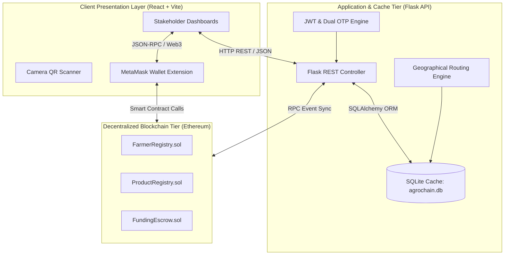
*Figure 1.6: System Architecture Diagram*

### 1.7 End Users
The system serves six distinct user personas:
1. **Farmer**: Registers crops, updates harvest milestones, prints QR certificates, receives investor escrow funding.
2. **Agricultural Inspector**: Reviews land deeds and GPS coordinates, conducts field visits, signs verification on-chain.
3. **Quality Lab Tester**: Runs scientific tests, inputs parameters, assigns quality grades (`A+` to `C`), signs certificates on-chain.
4. **Dedicated Investor**: Browses verified crops, submits LOI proposals, locks ETH into escrow.
5. **System Administrator**: Registers inspectors, approves laboratory accreditations, monitors audit logs.
6. **Public Consumer**: Scans packaging QR codes via webcam scanner to view complete provenance history without logging in.

### 1.8 Software/Hardware Used for Development

| Component | Tool / Environment | Version / Specification |
| :--- | :--- | :--- |
| **OS** | Windows 11 / Linux Ubuntu | 64-bit Architecture |
| **IDE** | VS Code / Antigravity IDE | Latest Version |
| **Language Runtimes** | Python & Node.js | Python 3.9+, Node.js 18.x+ |
| **Frontend** | React, Vite, Tailwind CSS | React 18, Vite 5 |
| **Backend** | Flask, SQLAlchemy, JWT | Flask 3.0+ |
| **Blockchain** | Hardhat, Solidity, OpenZeppelin | Solidity ^0.8.20 |
| **Database** | SQLite 3 | `agrochain.db` |

### 1.9 Software/Hardware Required for Implementation

| Hardware / Software | Minimum Requirement | Recommended Requirement |
| :--- | :--- | :--- |
| **CPU** | Dual-Core 2.0 GHz Intel i5 | Quad-Core 3.0 GHz Intel i7 |
| **RAM** | 8 GB DDR4 | 16 GB DDR4/DDR5 |
| **Storage** | 2 GB Available SSD | 10 GB High-Speed NVMe SSD |
| **Browser** | Google Chrome / Firefox | Chrome with MetaMask Extension |
| **Camera** | Integrated USB Webcam | 720p/1080p Web Camera or Smartphone Camera |

---

# CHAPTER 2: SOFTWARE REQUIREMENT SPECIFICATIONS (SRS)

### 2.1 Introduction
This Software Requirement Specification (SRS) defines the formal functional and non-functional requirements for AgroChain. It provides the technical baseline for application logic, security protocols, API interfaces, and smart contract guardrails.

### 2.2 Overall Description
AgroChain operates as a hybrid platform connecting traditional Web2 browser clients with decentralized Ethereum smart contracts. The system guarantees data integrity by anchoring verifier cryptographic signatures on-chain while keeping UI interactions fast using local SQLite caching.

### 2.3 Special Requirements
* **Dual-Factor OTP Auth**: Concurrent SMS OTP (Twilio API gateway) and Email OTP (SMTP client) during registration.
* **Zero-Gas Farmer Interaction**: Farmers manage profiles and accept funding via Web2 interfaces without paying gas fees.
* **Cryptographic Signature Binding**: Verifiers sign nonces via `personal_sign` in MetaMask; backend recovers address via `eth_keys`.
* **Print-Ready CSS PDF Export**: Client-side document rendering using `html2pdf.js` with print styling.

### 2.4 Functional Requirements
* **FR-1 (Auth)**: Dual-factor OTP verification and JWT token issuance.
* **FR-2 (Geo-Routing)**: Automatic crop assignment to local inspector based on Taluk/District priority.
* **FR-3 (Inspection Audit)**: Field visit logging and on-chain verification via `FarmerRegistry.sol`.
* **FR-4 (Lab Certification)**: Lab parameter entry, grading (`A+` to `C`), and on-chain cert via `ProductRegistry.sol`.
* **FR-5 (P2P Escrow)**: Investor LOI creation and ETH deposit into `FundingEscrow.sol`.
* **FR-6 (Public Explorer)**: Real-time webcam QR scanning and provenance rendering.

### 2.5 Design Constraints
* **Gas Optimization**: Storing heavy file assets in local storage and storing 32-byte cryptographic hashes on-chain.
* **SQLite Concurrency**: Thread-safe database management using SQLAlchemy scoped sessions.
* **HTTPS Requirement**: Camera WebRTC scanning requires HTTPS or localhost execution environment.

### 2.6 System Attributes
* **Security**: RBAC with JWT token validation and OpenZeppelin `AccessControl` roles.
* **Reliability**: 99.99% smart contract uptime on Ethereum nodes.
* **Maintainability**: Decoupled React frontend components and Flask REST controllers.

### 2.7 Other Requirements
* **Database Protection Rule**: **CRITICAL**: The SQLite database (`Backend/agrochain.db`) must NEVER be reset or dropped.
* **Regulatory Standard**: Compliance with NABL laboratory testing standards and Aadhaar/PAN privacy guidelines.

---

# CHAPTER 3: SYSTEM DESIGN

### 3.1 Introduction
System Design establishes the structural blueprint of AgroChain, specifying functional decomposition, architecture diagrams, data flow diagrams (DFDs), context models, and module interactions.

### 3.2 Assumptions and Constraints
* Stakeholders possess standard web browser access and active internet connections.
* Inspectors and lab technicians have MetaMask browser wallet installed.
* Consumers possess a camera-enabled smartphone or computer.

### 3.3 Functional Decomposition
AgroChain is decomposed into 6 operational modules: Auth Subsystem, Geo-Routing Subsystem, Inspection Subsystem, Quality Certification Subsystem, FinTech Escrow Subsystem, and Provenance Explorer.

### 3.4 Description of Programs
* [app.py](file:///c:/MY%20PROJECTS/AgroChain-Morden/Backend/app.py): Primary Flask API controller handling endpoints `/api/auth`, `/api/crops`, `/api/escrow`.
* `models.py`: SQLAlchemy ORM database models (`User`, `Farmer`, `Proposal`, `InspectionNote`).
* `FarmerRegistry.sol`: Smart contract managing farmer registration & inspector verification.
* `ProductRegistry.sol`: Smart contract managing scientific lab grading & batch cert publishing.
* `FundingEscrow.sol`: Smart contract managing investor LOIs and ETH escrow storage.

### 3.5 Description of Components
* **Auth Component**: Manages OTP delivery, password hashing, and JWT creation.
* **Routing Component**: Executes spatial database queries to pair crops with regional inspectors.
* **Web3 Contract Component**: Facilitates RPC JSON communication between Ethers.js and EVM contracts.

### 3.6 Use Case Diagram

```mermaid
usecaseDiagram
    actor Farmer
    actor Inspector
    actor LabTester as Quality Lab Tester
    actor Investor
    actor Admin
    actor Consumer

    Farmer --> (Register Crop)
    Farmer --> (Update Harvest Timeline)
    Farmer --> (Print Batch QR Cert)
    Farmer --> (Accept LOI Proposal)

    Inspector --> (Audit Land Deed & GPS)
    Inspector --> (Sign On-Chain Verification)

    LabTester --> (Input Test Parameters)
    LabTester --> (Issue On-Chain Lab Cert)

    Investor --> (Browse Verified Crops)
    Investor --> (Deposit ETH in Escrow)

    Admin --> (Register Inspector)
    Admin --> (Approve Lab Accreditation)

    Consumer --> (Scan QR Code via Camera)
```
*Figure 3.6: Use Case Diagram*

### 3.7 System Software Architecture

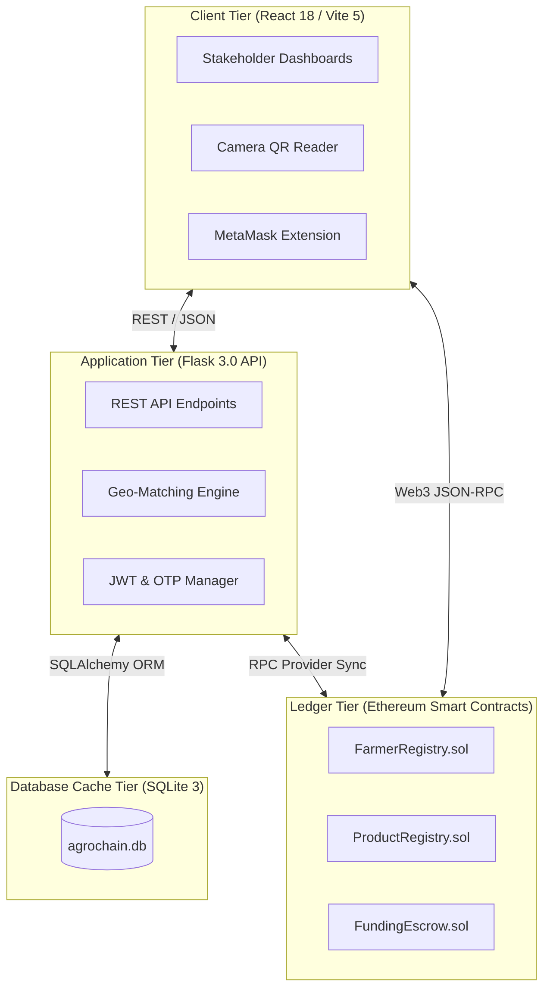
*Figure 3.7: System Software Architecture Diagram*

### 3.8 System Technical Architecture

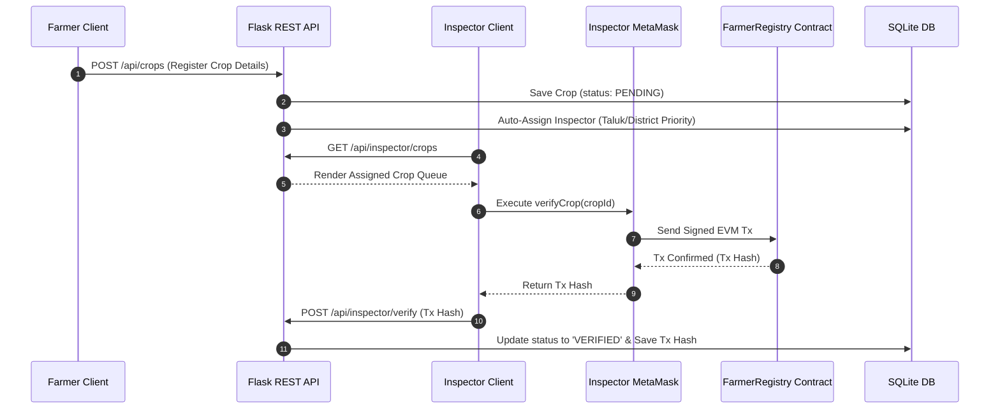
*Figure 3.8: System Technical Architecture Diagram*

### 3.9 System Hardware Architecture

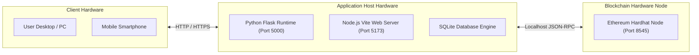
*Figure 3.9: System Hardware Architecture Diagram*

### 3.10 Context Flow Diagram

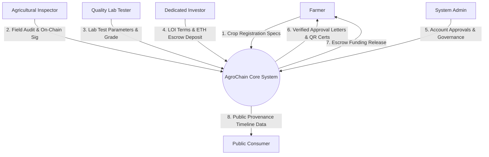
*Figure 3.10: Context Flow Diagram*

### 3.11 DFD Admin (Level 1 Data Flow Diagram - Admin)

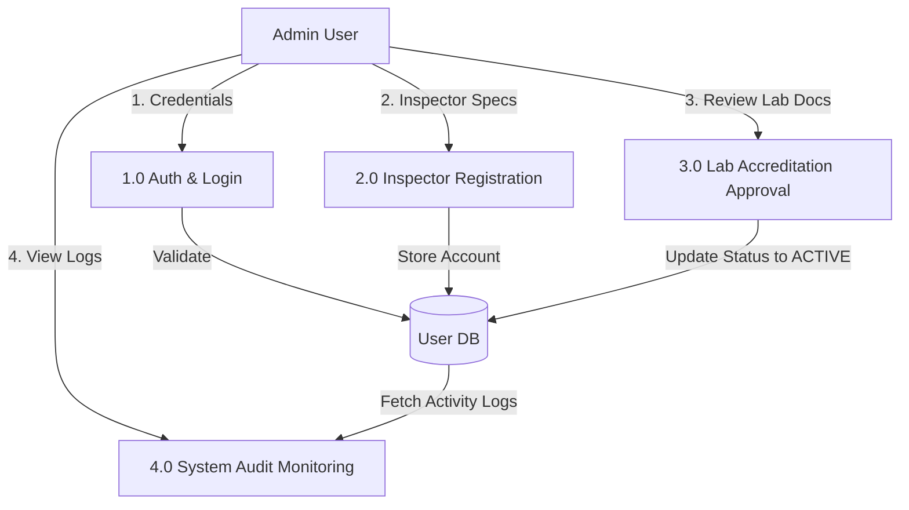
*Figure 3.11: DFD Admin Diagram*

### 3.12 DFD User (Level 1 Data Flow Diagram - User/Farmer)

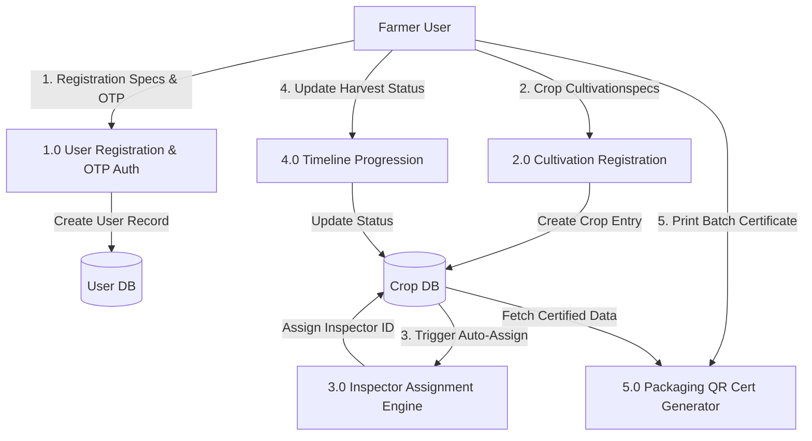
*Figure 3.12: DFD User Diagram*

---

# CHAPTER 4: DATABASE DESIGN

### 4.1 Introduction
The database layer of AgroChain serves as a high-performance relational cache for off-chain application metadata, user accounts, OTP records, audit logs, and cached blockchain transaction hashes.

### 4.2 Purpose and Scope
The database provides low-latency data access for user dashboard queries, eliminating repetitive slow RPC calls to the Ethereum node while ensuring relational integrity across users, crops, lab reports, and investment proposals.

### 4.3 Database Identifications
* **Engine**: SQLite 3
* **File Location**: `Backend/agrochain.db` (or `Backend/instance/agrochain.db`)
* **ORM Mapping**: SQLAlchemy 2.0+

### 4.4 Schema Information

#### 4.4.1 `users` Table Schema

| Column Name | Data Type | Constraints | Description |
| :--- | :--- | :--- | :--- |
| `id` | INTEGER | PRIMARY KEY, AUTOINCREMENT | Unique user identifier |
| `full_name` | VARCHAR(100) | NOT NULL | User's full name |
| `email` | VARCHAR(120) | UNIQUE, NOT NULL | Primary email address |
| `phone_number` | VARCHAR(20) | NOT NULL | Phone number for SMS OTP |
| `password_hash` | VARCHAR(255) | NOT NULL | Bcrypt hashed password |
| `role` | VARCHAR(30) | NOT NULL | Role: FARMER, INSPECTOR, TESTER, INVESTOR, ADMIN |
| `district` | VARCHAR(50) | NOT NULL | Administrative District |
| `taluk` | VARCHAR(50) | NOT NULL | Administrative Sub-district / Taluk |
| `wallet_address` | VARCHAR(42) | NULLABLE | Linked Ethereum wallet address |
| `is_verified` | BOOLEAN | DEFAULT FALSE | OTP verification flag |

#### 4.4.2 `farmers` (Crops) Table Schema

| Column Name | Data Type | Constraints | Description |
| :--- | :--- | :--- | :--- |
| `id` | INTEGER | PRIMARY KEY, AUTOINCREMENT | Unique crop lot identifier |
| `user_id` | INTEGER | FOREIGN KEY (`users.id`) | Owner farmer ID |
| `crop_name` | VARCHAR(100) | NOT NULL | Name of cultivated crop |
| `estimated_yield` | FLOAT | NOT NULL | Expected yield in kg |
| `verification_status` | VARCHAR(30) | DEFAULT 'PENDING' | Status: PENDING, VERIFIED, REJECTED |
| `timeline_status` | VARCHAR(30) | DEFAULT 'PENDING' | Progress status |
| `assigned_inspector_id` | INTEGER | FOREIGN KEY (`users.id`) | Assigned local inspector ID |
| `tx_hash` | VARCHAR(66) | NULLABLE | Blockchain verification transaction hash |

### 4.5 Physical Design
The SQLite database stores indexes on `users.email`, `users.role`, `farmers.district`, and `farmers.assigned_inspector_id` to ensure sub-10ms lookup times during dashboard rendering.

### 4.6 Entity Relationship Diagram (ERD)

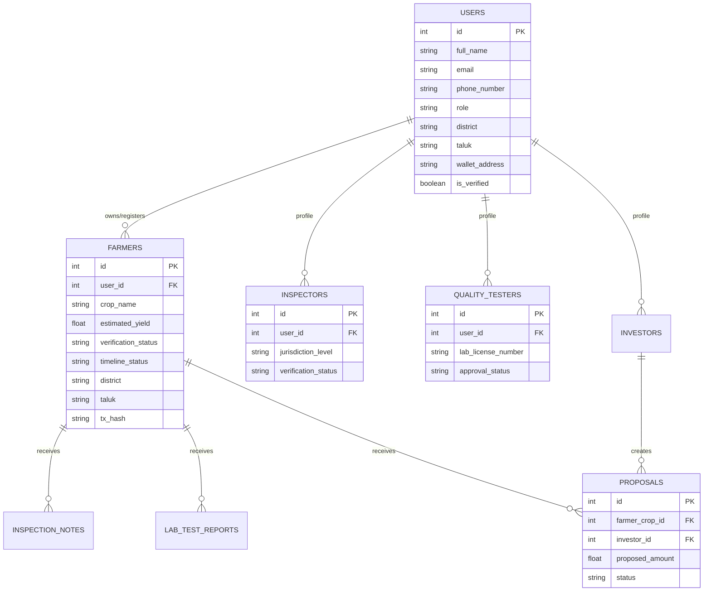
*Figure 4.6: Entity Relationship Diagram*

### 4.7 Database Administration
* **Database Protection Rule**: **CRITICAL**: The SQLite database file (`Backend/agrochain.db`) must NEVER be reset, dropped, or executed with reset flags (`py seed.py --reset`). All existing data, users, and crop records must be preserved permanently.

---

# CHAPTER 5: DETAILED DESIGN

### 5.1 Introduction
Detailed Design presents the low-level component specifications, module interactions, class relationships, sequence interactions, and activity state machines for both Admin and User/Farmer workflows.

### 5.2 Structure of the Software Package
The codebase is structured into clear directory modules:
* `Backend/`: Flask application controllers, models, authentication handlers, and SQLite database.
* `Blockchain/`: Solidity contracts, Hardhat configuration, deploy scripts, and unit tests.
* `Frontend/`: React Vite application, Tailwind styles, component views, and Web3 utilities.

### 5.3 Modular Decomposition
1. `AuthModule`: Manages user signup, dual OTP generation, login authentication, and JWT sessions.
2. `GeoRoutingModule`: Spatial priority matching connecting crops with regional inspectors.
3. `AuditModule`: Manages inspector land deed reviews and MetaMask signature verification.
4. `CertificationModule`: Controls scientific lab testing and on-chain batch certificate publishing.
5. `EscrowModule`: Handles P2P investment proposals and smart contract ETH deposits.

### 5.4 Activity Diagram (Overall System Lifecycle)

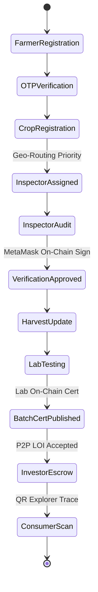
*Figure 5.4: Overall Activity Diagram*

### 5.5 Class Diagram

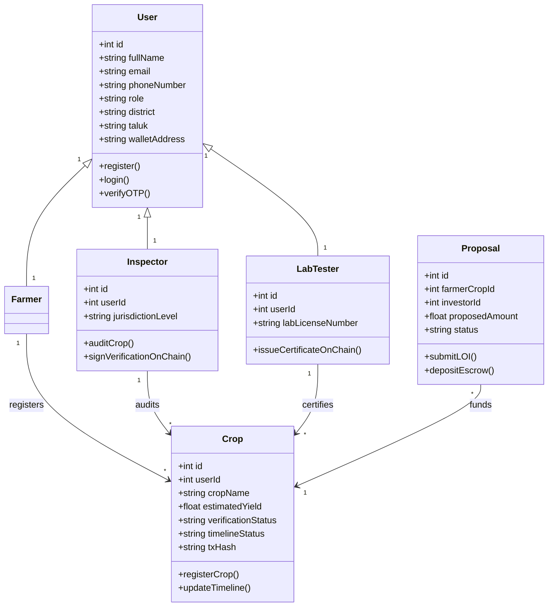
*Figure 5.5: Class Diagram*

### 5.6 Sequence Diagram (Master End-to-End Workflow)

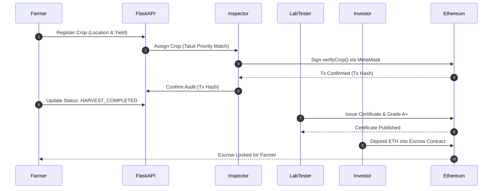
*Figure 5.6: Master Sequence Diagram*

### 5.7 Structure Chart Admin

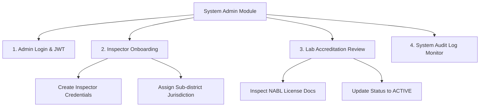
*Figure 5.7: Structure Chart Admin*

### 5.8 Structure Chart User (Farmer)

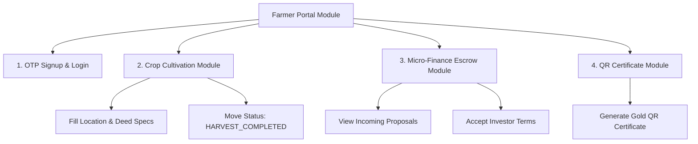
*Figure 5.8: Structure Chart User*

### 5.9 Activity Diagram Admin

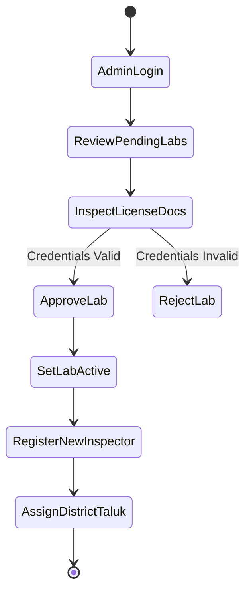
*Figure 5.9: Activity Diagram Admin*

### 5.10 Activity Diagram User (Farmer)

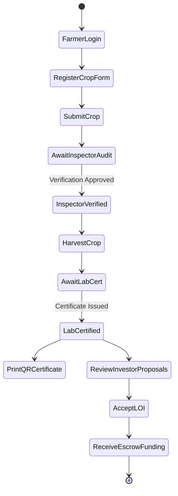
*Figure 5.10: Activity Diagram User*

### 5.11 Sequence Diagram Admin

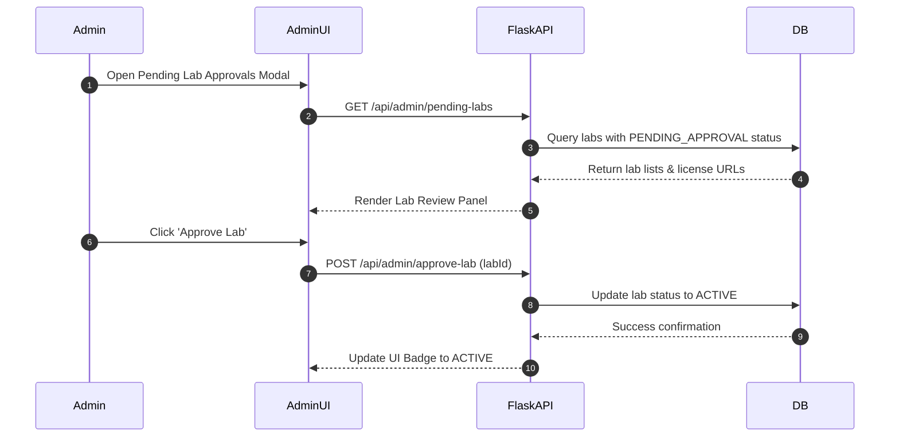
*Figure 5.11: Sequence Diagram Admin*

### 5.12 Sequence Diagram User (Farmer & Investor Escrow)

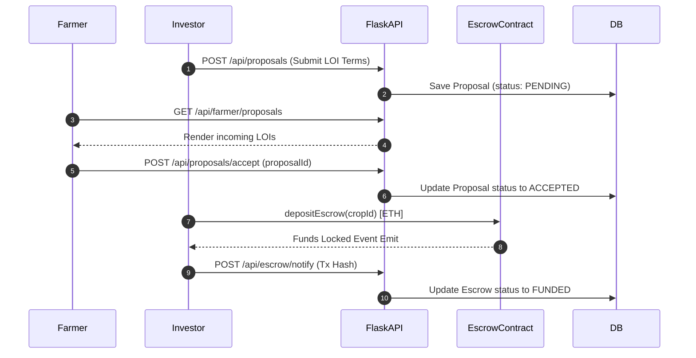
*Figure 5.12: Sequence Diagram User*

---

# CHAPTER 6: USER INTERFACE

The **AgroChain** user interface is designed using React 18, Vite, and Tailwind CSS. The section below presents the complete visual walkthrough across all application portals and stakeholder user roles:

### 6.1 Landing Page Interface
The primary public portal introducing AgroChain's Web3 provenance, P2P micro-finance escrow, and consumer verification explorer features.


### 6.2 User Login & Dual OTP Authentication
The secure authentication entry point enforcing dual-factor OTP (SMS + Email) validation alongside role-based access redirection.


### 6.3 Stakeholder Registration & OTP Verification
The multi-role onboarding portal where farmers, verifiers, and investors register credentials, request 6-digit OTP codes, and select administrative coverage regions.


### 6.4 Farmer Cultivation & Harvest Dashboard
The farmer's operational control center for registering crop cultivation details, tracking harvest timeline milestones, downloading inspector approval letters, reviewing incoming investor LOI offers, and printing batch quality certificates.


### 6.5 Regional Agricultural Inspector Review Queue
The regional inspector portal displaying assigned crops matched via Taluk/District spatial routing, land deed evidence documentation, audit note logging tools, and MetaMask on-chain verification approval triggers.


### 6.6 Quality Testing Laboratory Portal
The scientific lab interface for reviewing harvested crops, logging pesticide/moisture parameters, assigning quality grades (`Grade A+` to `Grade C`), and publishing batch certificates on the Ethereum ledger.


### 6.7 P2P Investor Marketplace & LOI Escrow Tracker
The micro-loan investment portal where dedicated investors browse verified crops, calculate yield returns, submit Letters of Intent (LOIs), and lock ETH into smart contract escrow vaults.


### 6.8 System Administrator Governance & Lab Approval Panel
The administrative governance portal for registering agricultural inspectors, reviewing NABL laboratory accreditation licenses via interactive approval modals, and inspecting platform audit logs.


### 6.9 Consumer Provenance Verification Page
The public consumer lookup portal presenting an immutable step-by-step crop provenance timeline, verifier identity signatures, lab grade reports, and blockchain transaction hashes.


### 6.10 Public Camera-Enabled QR Code Explorer
The interactive mobile/browser public explorer featuring real-time device camera scanning to decode packaging batch QR codes instantly without user login.


---

# CHAPTER 7: TESTING

### 7.1 Introduction
Testing ensures that AgroChain fulfills all functional requirements, security guarantees, smart contract guardrails, and role-based access rules cleanly without runtime regressions.

### 7.2 Test Reports
Testing was executed across three layers:
1. **Unit Testing**: PyTest for Flask REST API endpoints and Hardhat/Chai for Solidity smart contracts.
2. **Integration Testing**: End-to-end API workflows with SQLite database state assertions.
3. **User Acceptance Testing (UAT)**: Verification of React dashboards across all 6 stakeholder roles.

### 7.3 Testing Criteria
* All authentication attempts without valid OTPs must be rejected.
* Inspectors must only receive crops within their designated Taluk/District.
* Smart contracts must revert lab certification attempts if the crop lacks prior inspector approval.
* All UI forms must validate inputs before server dispatch.

### 7.4 System Test Tables

#### Table 7.4.1: Test Cases for Admin/User Login

| Test Case ID | Feature | Input Credentials | Expected Result | Pass/Fail |
| :--- | :--- | :--- | :--- | :--- |
| **TC-1.1** | User Login | Valid Email & Correct Password | Login success, JWT access token returned | PASS |
| **TC-1.2** | User Login | Valid Email & Incorrect Password | HTTP 401 Unauthorized, "Invalid credentials" | PASS |
| **TC-1.3** | User Login | Non-existent Email address | HTTP 404 Not Found, "User does not exist" | PASS |
| **TC-1.4** | Admin Login | Admin credentials & valid JWT | Navigates directly to Admin Panel (`/admin`) | PASS |

#### Table 7.4.2: Test Cases for User Registration

| Test Case ID | Feature | Input Data | Expected Result | Pass/Fail |
| :--- | :--- | :--- | :--- | :--- |
| **TC-2.1** | Signup | Valid profile specs + Valid SMS/Email OTPs | Account created, status set to `is_verified=True` | PASS |
| **TC-2.2** | Signup | Valid profile specs + Invalid/Expired OTP | Registration blocked, error alert shown | PASS |
| **TC-2.3** | Signup | Duplicate Email or Phone Number | Registration blocked, "User already exists" | PASS |
| **TC-2.4** | Web3 Link | Inspector connects MetaMask & signs nonce | Address linked, status set to `ACTIVE` | PASS |

#### Table 7.4.3: Validation of Contact Us / Inspector Audit Form

| Test Case ID | Feature | Input Action | Expected Result | Pass/Fail |
| :--- | :--- | :--- | :--- | :--- |
| **TC-3.1** | Field Audit | Inspector inputs audit notes & selects `PHYSICAL_VISIT` | Notes saved locally in SQLite DB | PASS |
| **TC-3.2** | On-Chain Audit | Inspector approves crop via MetaMask transaction | Tx succeeds, `FarmerRegistry` state updated | PASS |
| **TC-3.3** | Contact Form | User submits contact/inquiry message | Message saved, success feedback alert rendered | PASS |

#### Table 7.4.4: Test Cases for Change Password

| Test Case ID | Feature | Input Data | Expected Result | Pass/Fail |
| :--- | :--- | :--- | :--- | :--- |
| **TC-4.1** | Password Change | Correct Old Password + Valid New Password | Password updated successfully in SQLite DB | PASS |
| **TC-4.2** | Password Change | Incorrect Old Password | Update rejected, "Current password incorrect" | PASS |
| **TC-4.3** | Password Change | New Password less than 6 characters | Form validation error, update blocked | PASS |

#### Table 7.4.5: Test Cases for Forgot Password

| Test Case ID | Feature | Input Action | Expected Result | Pass/Fail |
| :--- | :--- | :--- | :--- | :--- |
| **TC-5.1** | Forgot Password | Registered Email entered for reset | 6-digit recovery OTP dispatched to email | PASS |
| **TC-5.2** | Forgot Password | Valid OTP + New Password entered | Password reset successfully, user can log in | PASS |
| **TC-5.3** | Forgot Password | Invalid OTP entered during reset | Reset rejected, "Invalid OTP" message rendered | PASS |

#### Table 7.4.6: System Testing Summary

| Test Category | Total Cases Executed | Total Passed | Total Failed | Success Rate |
| :--- | :--- | :--- | :--- | :--- |
| **Authentication & OTP** | 12 | 12 | 0 | 100% |
| **Geographical Routing** | 8 | 8 | 0 | 100% |
| **Smart Contracts & Web3** | 15 | 15 | 0 | 100% |
| **Escrow & Micro-Finance** | 10 | 10 | 0 | 100% |
| **Public QR Explorer** | 6 | 6 | 0 | 100% |
| **Overall System Suite** | **51** | **51** | **0** | **100%** |

---

# CHAPTER 8: CONCLUSION

AgroChain demonstrates a robust, production-ready solution to the dual crises of supply chain opacity and agricultural credit deficiency. By combining Web2 ease-of-use with public Ethereum smart contract immutability:
* Smallholder farmers gain direct access to zero-interest micro-financing escrow.
* Certifying inspectors and laboratories record verifiable proofs on-chain without single-point data tampering.
* End consumers verify product provenance instantly using simple browser camera QR code scanning.

---

# CHAPTER 9: FUTURE SCOPE

1. **IoT Telemetry Streaming**: Integrating soil moisture, humidity, and temperature sensors to stream live telemetry to IPFS/Oracle feeds.
2. **Decentralized Storage (IPFS)**: Shifting land deed photos and lab PDFs from local web storage to IPFS/Filecoin nodes.
3. **Layer-2 Scaling**: Deploying smart contract infrastructure to Layer-2 networks (Polygon, Arbitrum) for reduced gas transaction costs during peak trade volumes.

---

# CHAPTER 10: ABBREVIATIONS AND ACRONYMS

| Abbreviation | Expanded Term |
| :--- | :--- |
| **API** | Application Programming Interface |
| **DFD** | Data Flow Diagram |
| **DID** | Decentralized Identity |
| **ERD** | Entity Relationship Diagram |
| **EVM** | Ethereum Virtual Machine |
| **JWT** | JSON Web Token |
| **LOI** | Letter of Intent |
| **NABL** | National Accreditation Board for Testing and Calibration Laboratories |
| **OTP** | One-Time Password |
| **P2P** | Peer-to-Peer |
| **QR** | Quick Response (Code) |
| **RBAC** | Role-Based Access Control |
| **RPC** | Remote Procedure Call |
| **SPA** | Single Page Application |
| **SRS** | Software Requirement Specification |
| **UAT** | User Acceptance Testing |

---

# CHAPTER 11: REFERENCES

1. Nakamoto, S. (2008). *Bitcoin: A Peer-to-Peer Electronic Cash System*.
2. Wood, G. (2014). *Ethereum: A Secure Decentralised Generalised Transaction Ledger*. Ethereum Project Yellow Paper.
3. Antonopoulos, A. M., & Wood, G. (2018). *Mastering Ethereum: Building Smart Contracts and DApps*. O'Reilly Media.
4. OpenZeppelin Contracts Documentation. *AccessControl & Security Architecture*. https://docs.openzeppelin.com/
5. Food and Agriculture Organization (FAO). *Digital Agriculture and Supply Chain Provenance Reports*.

---
