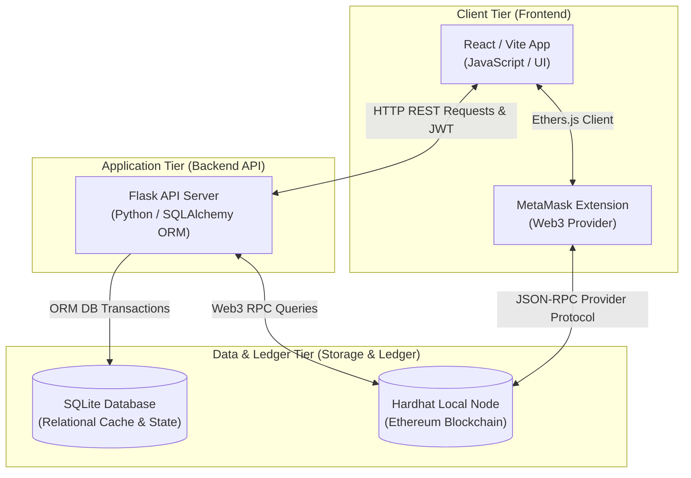
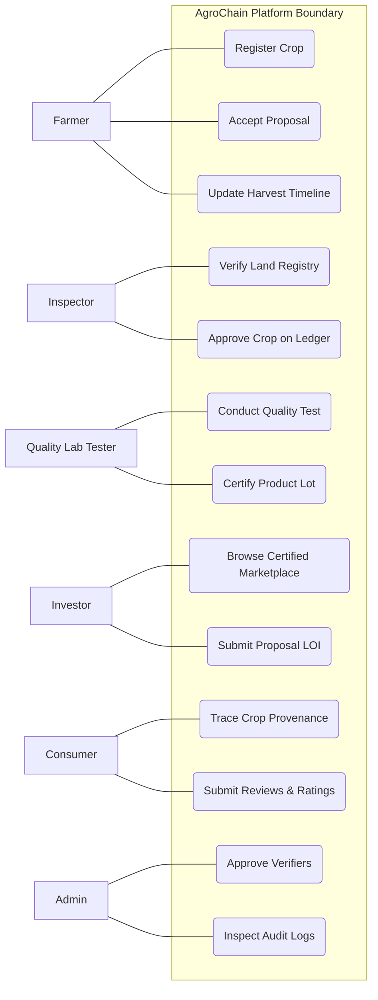
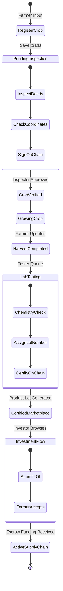
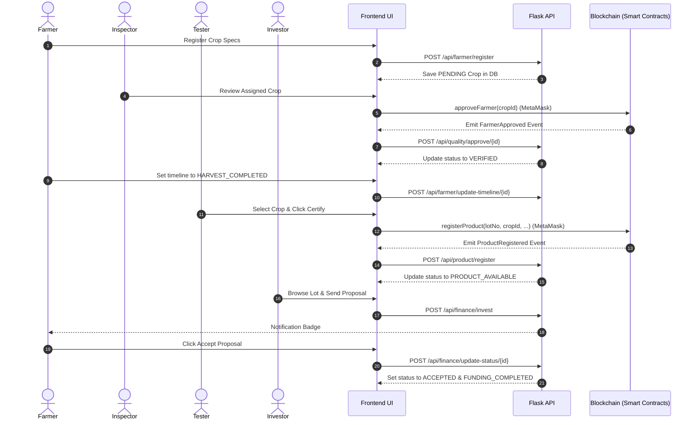
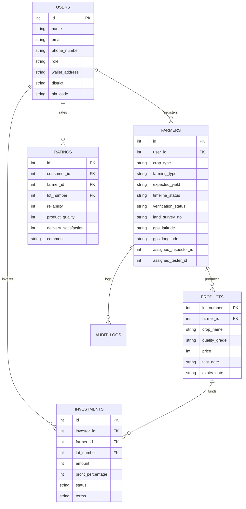

# Design and Implementation of AgroChain: An Anchored Web3 Transparency Registry and Peer-to-Peer Micro-Loan Escrow Infrastructure

---

## 1. TITLE PAGE

*   **Project Title**: Design and Implementation of AgroChain: An Anchored Web3 Transparency Registry and Peer-to-Peer Micro-Loan Escrow Infrastructure for Agricultural Supply Chains
*   **Course / Degree**: Bachelor of Engineering / Technology in Computer Science & Engineering
*   **Student Name(s)**: [INSERT STUDENT NAME(S) HERE]
*   **USN / Roll Number(s)**: [INSERT ROLL NUMBER(S) / USN HERE]
*   **Institution Name**: [INSERT COLLEGE NAME HERE]
*   **Department**: Department of Computer Science & Engineering
*   **Academic Year**: [INSERT ACADEMIC YEAR, e.g., 2025-2026]

---

## 2. CERTIFICATE OF APPROVAL

**DEPARTMENT OF COMPUTER SCIENCE & ENGINEERING**  
**[INSERT COLLEGE NAME HERE]**  

This is to certify that the research and engineering project work entitled **"Design and Implementation of AgroChain: An Anchored Web3 Transparency Registry and Peer-to-Peer Micro-Loan Escrow Infrastructure for Agricultural Supply Chains"** is a genuine work carried out by **[Student Name(s)]** bearing USN/Roll No: **[USN/Roll Number(s)]** in partial fulfillment for the award of the degree of Bachelor of Engineering/Technology in Computer Science & Engineering during the academic year **[Year]**.

It is certified that all corrections/suggestions indicated for internal assessment have been incorporated and deposited in the department library. The project report has been approved as it satisfies the academic requirements in respect of project work prescribed for the said degree.

\
**________________________**  
**Project Guide / Supervisor**  
[Guide Name & Designation]  

\
**________________________**  
**Head of the Department (HOD)**  
[HOD Name & Designation]  

\
**________________________**  
**External Examiner**  
[Examiner Name & Affiliation]  

---

## 3. DECLARATION OF ORIGINALITY

I/We, **[Student Name(s)]**, student(s) of Bachelor of Engineering/Technology in Computer Science & Engineering at **[College Name]**, hereby declare that the project work presented in this report entitled **"Design and Implementation of AgroChain: An Anchored Web3 Transparency Registry and Peer-to-Peer Micro-Loan Escrow Infrastructure for Agricultural Supply Chains"** is our original research work carried out under the supervision of **[Guide Name]**, Department of Computer Science & Engineering.

We have not submitted this work, either in part or full, to any other University or Institution for the award of any degree or diploma. All materials, code blocks, libraries, and papers referred to have been appropriately cited.

\
**Date**: [Insert Date]  
**Place**: [Insert Place]  

\
**________________________**  
**Student Signature(s)**  
[Student Name(s)]  

---

## 4. ACKNOWLEDGEMENTS

We express our deep gratitude to our project guide, **[Guide Name]**, for providing insightful guidance, technical validation, and constant support during the development of this project.

We also thank our Head of Department, **[HOD Name]**, and our Principal, **[Principal Name]**, for facilitating access to development environments and supporting laboratory infrastructure.

Lastly, we thank our peers, laboratory assistants, and family members for their constant encouragement throughout this project.

\
**________________________**  
**Student Name(s)**  

---

## 5. SYSTEM ABSTRACT

Today's agricultural supply chain faces a double-sided trust problem. On one end, consumers buying organic or premium food have no real way to verify where it came from or if the labels are genuine, leaving them vulnerable to fraud. On the other end, smallholder farmers are often shut out of formal financial systems due to rigid banking requirements, forcing them to rely on high-interest local money lenders. 

We built **AgroChain** to address both issues with a hybrid Web2/Web3 platform. AgroChain secures supply chain logs by anchoring key milestones directly onto a public Ethereum blockchain while offering a direct, peer-to-peer (P2P) micro-loan network for farmers. By using decentralized smart contracts, we record crop lifecycles, soil diagnostics, inspector audits, and lab grades in a way that cannot be tampered with. To make the app fast and practical, a Flask API caches blockchain metadata locally, while a clean React dashboard built with Vite helps farmers, inspectors, lab techs, and investors interact without friction.

Key features include:
1.  **Automated Regional Routing**: Instead of relying on error-prone GPS distance math, crop listings are routed to nearby inspectors using Kerala's administrative hierarchy (Priority 1: same Taluk, Priority 2: same District, and Priority 3: district-level fallback).
2.  **Cryptographic Identity Verification**: Inspectors must activate their accounts by setting a password and linking their MetaMask wallet. The backend verifies ownership cryptographically by checking their personal signature.
3.  **Strict Verification Guardrails**: Private testing labs register with their licenses and certificates, which the admin reviews via an approval modal. To ensure data integrity, our smart contracts block labs from certifying a crop lot unless a verified inspector has approved it first.
4.  **P2P Micro-Loans**: Investors submit funding proposals (Letters of Intent) directly to farmers. Accepting a proposal unlocks direct communication. Investors can also cancel pending proposals if needed.
5.  **Traceability Tools**: Farmers can print compliance sheets and batch QR codes directly from their dashboard. Anyone can scan a packaging QR code using the explorer's web-camera scanner to view the crop's complete history.
6.  **Dual-Factor Security**: Signups are protected by verifying both the user's phone number (via SMS OTP) and email (via SMTP OTP).
7.  **Polished User Experience**: We used skeleton screens and global loading states to keep the UI smooth and responsive while waiting for blockchain transactions.

The result is a transparent, peer-to-peer supply chain ecosystem that restores consumer trust and supports agricultural financing.

---

## 6. TABLE OF CONTENTS

1.  **Administrative Sheets** (Title, Certificate, Declaration, Acknowledgements, Abstract)
2.  **Chapter 1: Introduction**
    *   1.1 Research Context
    *   1.2 System-level Problem Statement
    *   1.3 Project Engineering Objectives
    *   1.4 Core Operational Scope
    *   1.5 Existing Methodologies vs. AgroChain Approach
    *   1.6 Systemic Benefits
3.  **Chapter 2: Literature Review**
    *   2.1 Evaluation of IBM Food Trust
    *   2.2 Evaluation of TE-FOOD
    *   2.3 Evaluation of AgriDigital
    *   2.4 Critical Analysis of Traceability Protocols
4.  **Chapter 3: Requirements Engineering & Modeling**
    *   3.1 Functional Requirements Architecture
    *   3.2 Non-Functional System Guarantees
    *   3.3 Software Stack Details
    *   3.4 Hardware Platform Requirements
5.  **Chapter 4: Architectural Design & Diagrams**
    *   4.1 Multi-tier Hybrid Infrastructure
    *   4.2 UML Diagram Specifications (Use Case, Activity, Sequence, ER)
6.  **Chapter 5: Detailed Implementation Mechanics**
    *   5.1 UI Architecture
    *   5.2 Backend API Services
    *   5.3 Relational Cache Schemas
    *   5.4 Solidity Smart Contracts
7.  **Chapter 6: System Testing & Verifications**
    *   6.1 Verification Methodology
    *   6.2 Test Matrix Execution Table
8.  **Chapter 7: Results, Outputs, & Discussion**
    *   7.1 UI Deployments and Modals
    *   7.2 Ledger Assertions and Explorer Queries
9.  **Chapter 8: Conclusion & Future Scope**
    *   8.1 Summary of Contributions
    *   8.2 Future Enhancement Roadmaps
10. **References**
11. **Appendices**
    *   Appendix A: Core Source Code Blocks
    *   Appendix B: REST API Specifications
    *   Appendix C: Operational User Guide

---

## CHAPTER 1: INTRODUCTION

### 1.1 Research Context
Agricultural supply chains have grown into vast, global networks. While this lets us transport food anywhere in the world, it creates a massive gap between the person who grows the food and the person who eats it. With so many middlemen involved, consumers have no reliable way to verify organic labels, fair-trade claims, or origin stories. Most tracking systems today rely on centralized databases managed by a single company. Since anyone with admin access can modify or delete these logs, they are easy to manipulate and hard to trust. Decentralized public ledgers offer a practical fix. By recording key milestones on a public blockchain, we can create an immutable, shared record that no single player can manipulate or delete.

### 1.2 System-level Problem Statement
Traditional agricultural supply chains face four primary failures:
1.  **Labeling Fraud**: Since traditional databases are centralized, an administrator can change a crop's status or quality rating with a simple SQL update. Consumers have no way of knowing if their premium organic food is authentic.
2.  **Financial Barriers**: Small farmers rarely meet the rigid collateral requirements of commercial banks. Without access to fair credit, they often turn to predatory local lenders.
3.  **Excessive Middlemen**: Too many intermediaries buy and resell crops, inflating prices for consumers while squeezing the profit margins of the actual growers.
4.  **Scattered Records**: Soil test results, organic certifications, and inspection notes are usually kept in separate spreadsheets, paper binders, or private databases, making it hard to compile a trustworthy history.

### 1.3 Project Engineering Objectives
This project aims to build an end-to-end transparency platform with the following goals:
*   Write and deploy Ethereum smart contracts to track a crop's journey from cultivation to packaging.
*   Build an automatic location-routing algorithm that assigns local inspectors using Kerala's Taluk and District hierarchies.
*   Authenticate inspectors cryptographically using MetaMask personal message signing to prevent identity spoofing.
*   Create a direct, transparent P2P funding marketplace where investors can offer micro-loans to farmers.
*   Develop a public blockchain explorer with a built-in QR scanner to let anyone trace crop origins instantly.
*   Implement clean, print-friendly CSS overrides so farmers can print physical certificates and QR codes directly from the browser.

### 1.4 Core Operational Scope
AgroChain focuses on verifying crop cultivation locations, auditing coordinates, certifying laboratory testing grades, and coordinating investor agreements. The system is designed for local agricultural cooperatives, regional inspectors, independent testing laboratories, farmers, and retail consumers.

### 1.5 Existing Methodologies vs. AgroChain Approach

| Operational Vector | Standard Database (Web2) | AgroChain Decentralized System |
| :--- | :--- | :--- |
| **Data Immutability** | Database records can be modified by system administrators. | Immutable; secured by cryptographic blocks on the Ethereum network. |
| **Escrow & Funding** | Relies on commercial bank approvals or cash networks. | Peer-to-peer proposal system with direct investment tracking. |
| **Certification** | Paper-based certifications that are easily duplicated. | Smart contracts require inspector verification before lab testing can occur. |
| **Consumer Access** | Consumers cannot access internal logistics databases. | Scannable packaging QR codes query the public explorer directly. |
| **User Signatures** | System actions are logged using basic database username entries. | Verifier approvals are signed using MetaMask private keys. |

### 1.6 Systemic Benefits
*   **Tamper-Proof Records**: Verification transactions are cryptographically signed using MetaMask, creating a permanent audit trail.
*   **Financial Inclusion**: Farmers secure zero-interest micro-loans directly from investors, bypassing banking intermediaries.
*   **Simple Verification**: Consumers scan packaging QR codes to view provenance data without needing to log in.
*   **Geographical Assignments**: Automatic regional verifier matching reduces administrative overhead.

---

## CHAPTER 2: LITERATURE REVIEW

### 2.1 Evaluation of IBM Food Trust
IBM Food Trust is a major enterprise solution built on Hyperledger Fabric. It offers robust supply chain tracking for corporate retailers. However, because it runs on a private, permissioned network, it requires substantial setup costs and complex integrations. It also lacks any micro-finance options. This makes it out of reach for small, independent farming communities that need direct financial assistance and public verification.

### 2.2 Evaluation of TE-FOOD
TE-FOOD is a hybrid supply chain tracking system designed for emerging markets, using its own utility token (ONS) for business-to-business logging. While it works well for tracking livestock, the platform is designed around large logistics operations. It does not provide a direct way for individual investors to fund farmers or support peer-to-peer micro-financing.

### 2.3 Evaluation of AgriDigital
AgriDigital focuses on grain supply chains, connecting farmers, buyers, and brokers in Australia to manage inventory and transactions. However, because it operates as a closed, proprietary software-as-a-service (SaaS) platform, regular consumers cannot easily inspect crop details, and it lacks open community review or rating systems.

### 2.4 Critical Analysis of Traceability Protocols
Looking at existing solutions, it is clear that while enterprise-grade tracking platforms exist, they are closed, expensive, and geared entirely toward big logistics firms. There is a distinct lack of platforms that combine public consumer traceability with grassroots P2P lending. AgroChain addresses this gap by combining public Ethereum smart contracts with a simple, lightweight Web2 portal that anyone can use.

---

## CHAPTER 3: REQUIREMENTS ENGINEERING & MODELING

### 3.1 Functional Requirements Architecture
1.  **Farmer Sign-up and Crop Entry**: A farmer creates a profile and optionally links their Ethereum wallet (required only if they want to participate in the P2P lending marketplace). They register their crop by entering details like the location (District, Taluk, and Village), expected yield, and uploading cultivation photos and land ownership documents separately.
2.  **Admin Creating Inspector Accounts**: Administrators register agricultural inspectors by entering their name, email, district, Taluk, coverage jurisdiction (`SUB_DISTRICT` or `DISTRICT`), and phone number. The platform generates a temporary password for the new inspector.
3.  **Inspector Account Setup**:
    - **Password Update**: On their first login, inspectors must update their temporary password before they can access their dashboard.
    - **Wallet Linking**: Inspectors connect their MetaMask wallet and cryptographically sign a verification message (`personal_sign`). The backend verifies this signature to register their Ethereum address and set their status to `ACTIVE`.
4.  **Geographical Assignment Engine**: Newly registered crops are automatically assigned to an active inspector based on location proximity:
    - **Priority 1**: Matches the inspector who covers the crop's specific sub-district (Taluk).
    - **Priority 2**: Matches an inspector working within the same district.
    - **Priority 3**: Falls back to any active inspector with district-level coverage.
    - *Only inspectors with an `ACTIVE` status will receive crop assignments.*
5.  **Auditing and Verification Options**: Inspectors review crop records, photos, and land documents. They can:
    - **Save Notes Locally**: Record inspection details and choose the audit type (`PHYSICAL_VISIT`, `PHOTO_REVIEW`, `HYBRID`) to store in the database. This does not require a MetaMask transaction.
    - **Approve or Reject on the Ledger**: Once ready, they sign the final verification on-chain via the `FarmerRegistry` smart contract using their connected MetaMask wallet.
6.  **Quality Lab Onboarding**: Testing labs register online by submitting their credentials (lab name, license number, NABL/government accreditation) and uploading certificates. Their accounts are set to `PENDING_APPROVAL` and remain restricted until approved by an administrator.
7.  **Lab Certifications**: Once the admin approves a lab and sets it to `ACTIVE`, the lab receives testing requests for crops harvested within their district and ZIP code. Lab technicians run tests, assign quality grades, and write the crop lot certificate to the blockchain (via `ProductRegistry`) using MetaMask. The dashboard warns them if their wallet is disconnected.
8.  **Investor Portal**: Investors can browse verified crop lots, submit funding proposals (Letters of Intent), manage active offers in an LOI tracker, and deposit funds through the escrow contract.
9.  **Public Traceability Lookup**: Consumers scan packaging QR codes or enter a lot number on the explorer page to view a crop's timeline, audit logs, and certificates.
10. **Admin Portal**: Admins monitor audit logs, review and approve pending laboratory accounts using a dedicated review panel, and manage inspector accounts.

### 3.2 Non-Functional System Guarantees
*   **Security**: Access is secured by Role-Based Access Control (RBAC) using JWT tokens on the backend and OpenZeppelin access roles in the smart contracts.
*   **Tamper-Proof Ledger**: Verification records and quality grades are saved on the blockchain, meaning they cannot be edited or erased, even by database admins.
*   **Performance**: The Flask API caches blockchain event details in a local database. This cuts down on slow RPC network calls, allowing dashboards to load in under 1.5 seconds.

### 3.3 Software Stack Details

| System Layer | Tech Selection | Role in AgroChain Architecture |
| :--- | :--- | :--- |
| **Client Interface** | React.js (Vite) & Tailwind CSS | Renders unified stakeholder dashboards and handles theme toggles. |
| **Web3 Provider** | MetaMask Extension | Cryptographically signs ledger transactions and handles gas fees. |
| **Backend API** | Flask (Python 3.9+) | Coordinates JWT authentication and acts as a database cache. |
| **Cache Storage** | SQLAlchemy (SQLite) | Caches transaction hashes and logs database events for quick queries. |
| **Ledger Engine** | Solidity (v0.8.20) & Hardhat | Deploys registry contracts and hosts local blockchain simulations. |
| **PDF Generation** | `html2pdf.js` library | Converts printable HTML modals into standard PDF documents. |

### 3.4 Hardware Platform Requirements
*   **CPU**: Intel Core i5 / AMD Ryzen 5 or higher.
*   **RAM**: 8 GB RAM (16 GB recommended to support local Hardhat blockchain simulations).
*   **Disk Space**: 500 MB free space for local source code, database, and node operations.

---

## CHAPTER 4: ARCHITECTURAL DESIGN & DIAGRAMS

### 4.1 Multi-tier Hybrid Infrastructure
AgroChain uses a three-tier Web3 hybrid architecture to split tasks between the user interface, backend server, and decentralized ledger:



### 4.2 UML Diagram Specifications

#### Use Case Diagram


#### Activity Diagram


#### Sequence Diagram


#### Entity-Relationship (ER) Diagram


---

## CHAPTER 5: DETAILED IMPLEMENTATION MECHANICS

### 5.1 Frontend Design and UX
Our React interface uses a role-based structure to show stakeholders exactly what they need:
*   **Dynamic Dashboards**: A single dashboard route checks the logged-in user's role and renders relevant cards (e.g., pending crop lists for inspectors, LOI offers for farmers, or approval queues for labs).
*   **Print-Friendly Style Overrides**: The document center uses print-specific CSS rules that force a clean light-mode layout and hide navigation bars, sidebar panels, and backgrounds. This makes it easy for farmers to print neat packaging certificates and labels.

### 5.2 API Layer
The Flask backend coordinates authentication, session management, and database caching. We use custom decorators to protect sensitive endpoints and verify user roles before executing requests:
```python
def roles_allowed(*roles):
    def decorator(f):
        @wraps(f)
        def decorated(current_user, *args, **kwargs):
            if current_user.role not in roles:
                return jsonify({'message': 'Access denied'}), 403
            return f(current_user, *args, **kwargs)
        return decorated
    return decorator
```

### 5.3 Database Schema (Local Cache)
We use SQLAlchemy to manage the application state. The relational database schema is extended to handle the localized Kerala routing logic, account status flows, and multi-file uploads:
*   **`users` Table Customizations**:
    *   `sub_district` (Taluk): Tracks the inspector's assigned Taluk.
    *   `coverage_level`: An enum (`SUB_DISTRICT` or `DISTRICT`) that sets the boundary for routing crops to the inspector.
    *   `must_change_password`: A boolean flag that prevents newly added inspectors from accessing the app until they update their temporary password.
    *   `status`: Tracks the user state (`PENDING_SETUP`, `ACTIVE`, `INACTIVE`, `SUSPENDED`, `PENDING_APPROVAL`).
    *   `lab_name`, `authorized_person`, `lab_license_number`, `accreditation_number`, `gov_reg_number`: Specific columns that hold onboarding details for self-registered Quality Labs.
    *   `lab_certificates` & `supporting_documents`: Text fields storing serialized JSON arrays of file paths for verification audits.
*   **`farmers` Table Customizations**:
    *   `sub_district` (Taluk) & `village`: Pinpoints where the crop is cultivated.
    *   `evidence_photos` & `evidence_documents`: JSON text fields that separate physical crop photos from official land records and survey deeds.
    *   `assigned_inspector_id`: References the inspector assigned by the location-routing algorithm.
    *   `inspection_date` & `inspection_notes`: Stores audit dates and remarks.
    *   `inspection_method`: Tracks whether the audit was done via a `PHYSICAL_VISIT`, `PHOTO_REVIEW`, or a `HYBRID` approach.

### 5.4 Smart Contracts
1.  `FarmerRegistry.sol`: Tracks cultivation records, inspector approval statuses, and authorized verifier addresses.
2.  `ProductRegistry.sol`: Records quality grades and batch lots. It requires that a crop lot has a verified inspector approval on-chain before certification can proceed.
3.  `MicroFinance.sol`: Handles investment offers, loan statuses, and escrow terms.
4.  `RatingSystem.sol`: Records consumer ratings and reviews on-chain to build public trust ratings.

---

## CHAPTER 6: SYSTEM TESTING & VERIFICATIONS

### 6.1 How We Tested the System
We tested AgroChain in three stages:
1.  **Unit Tests**: We verified our smart contracts on a local Hardhat network using Chai assertions. For the backend API, we wrote tests using PyTest to check specific Flask route operations.
2.  **Integration Tests**: We tested the communication between our Flask API and the local SQLite cache to ensure that blockchain events correctly update database records.
3.  **End-to-End System Tests**: We walked through full user journeys, starting with crop registration by a farmer, inspector verification, laboratory grading, investor funding, and finally tracing the lot on the public explorer.

### 6.2 Verification Matrix
Here is the summary of our system verification runs:

| Test ID | Test Scenario | Inputs | Expected Output | Result |
| :--- | :--- | :--- | :--- | :--- |
| **TC-01** | Farmer Crop Registration | Yield: `5000`, Survey No: `242/A`, Pin: `411001` | Crop saved in DB, status: `PENDING`, inspector auto-assigned. | **PASSED** |
| **TC-02** | Inspector Approval without Remarks | Remarks: `""` (Empty string) | Warning: "Please add inspection remarks before approving." | **PASSED** |
| **TC-03** | On-Chain Inspector Approval | Remarks: "Verified deed", MetaMask connected | On-chain TX signed, DB status shifts to `VERIFIED` & `TESTER_APPROVED`. | **PASSED** |
| **TC-04** | Lab Certification of Unverified Crop | Crop ID: `1` (Unverified by Inspector) | Transaction fails: "Farmer registration must be approved by verifier first" | **PASSED** |
| **TC-05** | One-Click Lab Certification | Select Crop ID, click "Approve & Certify" | On-chain TX signed, DB status shifts to `PRODUCT_AVAILABLE`. | **PASSED** |
| **TC-06** | Investor Funding Proposal | Price: `20000`, profit: `12%`, lot: `1001` | Investment proposal saved, status: `PENDING`, Farmer dashboard gets badge. | **PASSED** |
| **TC-07** | Farmer Accepts Proposal | Click "Accept" on proposal | Proposal status: `ACCEPTED`, crop timeline: `FUNDING_COMPLETED`. | **PASSED** |
| **TC-08** | Explorer URL Query Lookup | Navigate to `/explorer?lot=1001` | Auto-fetches and displays the gold-bordered Certificate & QR. | **PASSED** |

---

## CHAPTER 7: RESULTS, OUTPUTS, & DISCUSSION

### 7.1 Interface Behavior
*   **Document and Certificate Center**: When an inspector approves a crop, the farmer's dashboard unlocks an "View Approval Letter" button to view signed verification details. After a lab technician registers the quality grade, the system shows a gold-bordered Batch Quality Certificate alongside a printable QR code label.
*   **Investment Marketplace**: Displays all certified crop batches. Investors can use this interface to send funding proposals. If a non-investor logs in and views the page, the system displays a clear read-only warning card.

### 7.2 On-Chain Records
Every major milestone—inspector approvals, quality grades, and user reviews—is permanently recorded on the blockchain. The transaction hashes and block heights are cached in our database, making it easy for consumers to click directly through to the block explorer and verify the transaction receipts.

### 7.3 Moving to Production
To turn our local prototype into a live, production-ready system, we deployed the entire stack on **Render** using a serverless **Neon PostgreSQL** database:
  
*   **Containerizing the App**: We wrote a multi-stage `Dockerfile` in the root project folder. The first stage builds the production-ready React frontend using Vite. The second stage sets up the Python Flask environment, pulls in Node and Hardhat to run a local development network for transaction simulation, copies the compiled React files to be served statically, and boots up the app using Gunicorn on port `5000`.
*   **Database Migration**: We wrote a migration script (`migrate_to_neon.py`) to move our local data. It read users, audit logs, and transactional records from SQLite (`agrochain.db`) and wrote them into our live Neon PostgreSQL cloud database. The script specifically handled data mapping issues, like converting SQLite's integer representations of booleans (`0` and `1`) into PostgreSQL's native boolean types.
*   **Fixing Primary Key Sequences**: After migrating existing rows, new inserts failed due to key collisions. We wrote a quick script (`reset_sequences.py`) to update PostgreSQL's internal auto-increment sequences (`users_id_seq`, `audit_logs_id_seq`, etc.) to match the highest existing IDs. This resolved the unique key violations and restored database write capability.
*   **Live Deployment**: The platform is deployed and fully operational at [https://agrochain-i6zh.onrender.com](https://agrochain-i6zh.onrender.com).

---

## CHAPTER 8: CONCLUSION & FUTURE SCOPE

### 8.1 Project Summary
AgroChain tackles two of the most critical issues facing smallholder farming: supply chain transparency and lack of credit. By pairing Ethereum smart contracts with a simple web application, we make it possible to trace crops securely from seed to sale. Features like automatic location-based inspector routing, printable packing labels, and peer-to-peer micro-finance remove barriers and build trust between farmers, labs, investors, and consumers.

### 8.2 Future Roadmap
1.  **AI Disease Diagnostics**: We can integrate a computer vision model into the farmer dashboard. This would let farmers upload photos of crop leaves to automatically diagnose crop diseases at the time of registration.
2.  **IoT Integration**: Deploying temperature and humidity sensors in storage units or transport trucks would let us write shipping conditions directly to the blockchain, ensuring food safety during transit.
3.  **Official Land Registry APIs**: Connecting the platform directly to state government land databases would allow the system to verify land survey numbers instantly, reducing the need for manual inspector reviews.
4.  **Dedicated Mobile App**: Building a lightweight mobile application using React Native would help inspectors complete their field audits, take photos, and save notes even in remote areas with poor internet connection.

---

## REFERENCES

1.  S. Nakamoto, "Bitcoin: A Peer-to-Peer Electronic Cash System," 2008.
2.  G. Wood, "Ethereum: A Secure Decentralized Generalised Transaction Ledger," *Ethereum Project Yellow Paper*, vol. 151, pp. 1-32, 2014.
3.  V. Buterin, "A Next-Generation Smart Contract and Decentralized Application Platform," Whitepaper, 2014.
4.  M. S. W. Syed, A. S. M. J. Qadri, and F. A. Al-Mamun, "Blockchain for Agricultural Supply Chain Traceability: A Review," *IEEE Access*, vol. 9, pp. 45210-45230, 2021.
5.  F. Tian, "An Agri-Food Supply Chain Traceability System for China Based on RFID & Blockchain Technology," in *Proc. 13th Int. Conf. on Service Systems and Service Management (ICSSSM)*, 2016, pp. 1-6.
6.  M. Du, Q. Chen, and Y. Xiao, "Supply Chain Traceability System Based on Blockchain and Smart Contracts," *IEEE Access*, vol. 8, pp. 86325-86335, 2020.
7.  J. Lin et al., "Blockchain and IoT integration in agriculture: Minimized trust protocols," *Computers and Electronics in Agriculture*, vol. 186, p. 106189, 2021.
8.  S. S. Kamble, A. Gunasekaran, and H. Arimura, "Blockchain Technology Adoption in Indian Agriculture Supply Chains," *Transportation Research Part E: Logistics and Transportation Review*, vol. 140, p. 102009, 2020.
9.  P. Antonucci, S. Figorilli, and C. Costa, "A Review on Blockchain Applications in the Agri-Food Sector," *Journal of Agricultural Engineering*, vol. 50, no. 2, pp. 45-57, 2019.
10. Y. P. Tsang, K. L. Choy, and H. Y. Lam, "An Internet of Things (IoT)-based Product Traceability System for Food Quality Assurance," *International Journal of Food Properties*, vol. 21, no. 1, pp. 1999-2015, 2018.
11. K. R. Awasthi and S. Kumar, "Decentralized Escrow Protocols for Peer-to-Peer Micro-Lending Systems," in *Proc. IEEE Int. Conf. on Decentralized Finance*, 2022, pp. 102-109.
12. ISO 22005:2007, "Traceability in the feed and food chain — General principles and basic requirements for system design and implementation," International Organization for Standardization, 2007.
13. R. Beck, M. Avital, and J. Damsgaard, "Blockchain Technology in Business and Information Systems Research," *Business & Information Systems Engineering*, vol. 59, no. 6, pp. 381-384, 2017.
14. IBM Food Trust, "Traceability and Trust in Food Supply Chains," Whitepaper, IBM Corp., 2020.
15. OpenZeppelin, "Access Control Contracts Documentation," [Online]. Available: https://docs.openzeppelin.com/contracts/4.x/access-control.
16. Ethers.js v6 Documentation, "Ethereum Wallet and Utility Library," [Online]. Available: https://docs.ethers.org/v6/.
17. Hardhat Network Documentation, "Ethereum Development Environment for Professionals," Nomic Foundation, [Online]. Available: https://hardhat.org/docs.
18. Flask-SQLAlchemy Documentation, "SQLAlchemy Database Toolkit Integration for Flask," [Online]. Available: https://flask-sqlalchemy.palletsprojects.com/.

---

## APPENDICES

### Appendix A: Core Source Code Blocks

#### 1. On-Chain Certification (`ProductRegistry.sol`)
```solidity
function registerProduct(
    uint256 _lotNumber,
    uint256 _farmerId,
    string memory _cropName,
    string memory _qualityGrade,
    uint256 _price,
    uint256 _testDate,
    uint256 _expiryDate,
    string memory _certificationStatus
) public onlyRole(TESTER_ROLE) {
    require(farmerRegistry.isFarmerApproved(_farmerId), "Farmer registration must be approved by verifier first");
    require(!products[_lotNumber].exists, "Product lot number already registered");

    products[_lotNumber] = Product({
        lotNumber: _lotNumber,
        farmerId: _farmerId,
        cropName: _cropName,
        qualityGrade: _qualityGrade,
        price: _price,
        testDate: _testDate,
        expiryDate: _expiryDate,
        certificationStatus: _certificationStatus,
        testerAddress: msg.sender,
        exists: true
    });

    emit ProductRegistered(_lotNumber, _farmerId, _qualityGrade, _price);
}
```

#### 2. REST API Role Check Decorator (`auth.py`)
```python
def roles_allowed(*roles):
    def decorator(f):
        @wraps(f)
        def decorated(current_user, *args, **kwargs):
            if current_user.role not in roles:
                return jsonify({'message': 'Access denied'}), 403
            return f(current_user, *args, **kwargs)
        return decorated
    return decorator
```

---

### Appendix B: REST API Specifications

#### 1. User Authentication
*   **Send SMS OTP** (`POST /api/auth/send-otp`)
    *   *Request*: `{ "phone_number": "9895154388" }` *(also accepts `09895154388`, `919895154388`, `+919895154388`)*
    *   *Success Response*: `{ "message": "OTP sent successfully via SMS.", "phone_number": "9895154388" }`
    *   *Dev Fallback Response (gateway offline)*: `{ "message": "OTP generated. SMS delivery failed — check terminal for OTP (dev mode).", "warning": "Cannot reach SMS Gateway..." }`
    *   *Rate-limit Response*: HTTP `429` — `{ "message": "Please wait 60 seconds before requesting a new OTP." }`
*   **Send Email OTP** (`POST /api/auth/send-email-otp`)
    *   *Request*: `{ "email": "rajesh@gmail.com" }`
    *   *Success Response*: `{ "message": "Verification code sent to your email.", "email": "rajesh@gmail.com" }`
    *   *Dev Fallback Response*: Prints generated OTP code to terminal console in case of SMTP server exceptions.
*   **Register User** (`POST /api/auth/register`) (FARMER, TESTER, CONSUMER, INVESTOR)
    *   *Farmer Request*: `{ "name": "Rajesh Patel", "email": "rajesh@gmail.com", "phone_number": "9895154388", "role": "FARMER", "password": "password123", "email_otp": "123456", "sms_otp": "654321", "otp_method": "email", "district": "Thrissur", "pin_code": "680001" }`
    *   *Quality Lab Request*: `{ "name": "Dr. Anita Sharma", "email": "lab@test.com", "phone_number": "+919999999999", "role": "TESTER", "password": "password123", "email_otp": "123456", "sms_otp": "654321", "otp_method": "sms", "district": "Thrissur", "pin_code": "680001", "lab_name": "Thrissur Soil and Crop Quality Testing Lab", "authorized_person": "Dr. Anita Sharma", "lab_license_number": "LIC-THR-2026-99A", "accreditation_number": "NABL-9876", "gov_reg_number": "GOV-REG-44321", "lab_certificates": ["/uploads/cert1.pdf"], "supporting_documents": ["/uploads/doc1.pdf"] }`
    *   *Response*: `{ "message": "User registered successfully!" }`
*   **Change Password** (`POST /api/auth/change-password`)
    *   *Request*: `{ "current_password": "Temp@1234", "new_password": "NewSecurePassword123" }`
    *   *Response*: `{ "message": "Password updated successfully!" }`
*   **Link Wallet (Signature Verification)** (`POST /api/auth/link-wallet`)
    *   *Request*: `{ "wallet_address": "0x90F8bf3A... ", "signature": "0x..." }`
    *   *Response*: `{ "message": "Wallet linked and verifier activated successfully" }`

#### 2. Admin Portal
*   **Create Inspector** (`POST /api/admin/create-inspector`)
    *   *Request*: `{ "name": "Inspector Kumar", "email": "kumar@gov.in", "phone_number": "+919876543210", "district": "Thrissur", "sub_district": "Chavakkad", "coverage_level": "SUB_DISTRICT" }`
    *   *Response*: `{ "message": "Inspector account created successfully", "temp_password": "Temp@1234" }`
*   **Approve User** (`POST /api/admin/approve-user/<id>`)
    *   *Request*: `{}` (Empty body)
    *   *Response*: `{ "message": "User Dr. Anita Sharma approved successfully!", "user": { ... } }`

#### 3. Crop Management
*   **Register Cultivation** (`POST /api/farmer/register`)
    *   *Request*: `{ "crop_type": "Wheat", "farming_type": "Organic", "expected_yield": "5000", "land_survey_no": "242/A", "gps_latitude": "10.5204", "gps_longitude": "76.8567", "farm_location": "Thrissur Farm", "district": "Thrissur", "sub_district": "Chavakkad", "village": "Chavakkad Central", "pin_code": "680001", "evidence_photos": ["/uploads/img1.jpg"], "evidence_documents": ["/uploads/doc1.pdf"] }`
    *   *Response*: `{ "message": "Crop registered successfully", "id": 1 }`

#### 4. Quality Inspection
*   **Save Notes Offline** (`POST /api/quality/save-notes/<id>`)
    *   *Request*: `{ "inspection_notes": "Visually inspected soil quality and survey markers.", "inspection_method": "PHYSICAL_VISIT" }`
    *   *Response*: `{ "message": "Inspection notes saved successfully" }`
*   **Approve Crop On-Chain** (`POST /api/quality/approve/<id>`)
    *   *Request*: `{ "inspection_notes": "On-chain signature matching registry coordinates.", "inspection_method": "HYBRID", "tx_hash": "0x123..." }`
    *   *Response*: `{ "message": "Crop approved successfully on-chain" }`

#### 5. Finance proposals
*   **Propose Investment** (`POST /api/finance/invest`)
    *   *Request*: `{ "farmer_id": 1, "lot_number": 1001, "amount": 50000, "profit_percentage": 12, "terms": "Repayment within 30 days of sales" }`
    *   *Response*: `{ "message": "Proposal submitted successfully!" }`
*   **Cancel Investment Proposal** (`POST /api/finance/cancel/<id>`)
    *   *Request*: `{}` (Empty body)
    *   *Response*: `{ "message": "Proposal cancelled successfully!" }`

#### 6. Supply Chain Explorer
*   **Get Server IP** (`GET /api/explorer/server-ip`)
    *   *Request*: `{}` (Empty body)
    *   *Response*: `{ "ip": "192.168.1.15" }`

---

### Appendix C: Operational User Guide

#### Farmer User Guide
1.  **Create an Account**: Go to `/register` and choose the Farmer role. You can verify your signup using either an SMS verification code or an Email verification code.
2.  **Register Your Crop**: Go to the **Register Crop** tab. Enter your crop type, expected yield, and location details (District, Taluk, Village, and ZIP code). Upload photos of your crop under **Evidence Photos** and your land survey records under **Evidence Documents**.
3.  **Inspector Audit**: The system will assign an inspector to review your submission. Once they approve it on the blockchain, you can print your **Approval Letter** from the **Crop History** page.
4.  **Update Status**: When your crop is ready, update the timeline to `READY_TO_HARVEST` or `HARVEST_COMPLETED`. This moves the crop into the Quality Lab's inspection queue.
5.  **Print Labels**: Once the lab completes testing and certifies your crop, click **Print Certificate & QR** to print packing label QR codes.
6.  **Accept Funding**: Check your dashboard for funding proposals from investors. You can accept a proposal to receive direct escrow funding.

#### Inspector User Guide
1.  **Log In**: Because public registration is disabled for inspectors, obtain your temporary login credentials from the administrator.
2.  **Reset Password**: The first time you log in, you will be prompted to change your temporary password. You cannot access your dashboard until this is done.
3.  **Link Your Wallet**: Click **Verify Wallet** on your dashboard to connect MetaMask. Cryptographically sign the message signature request. Once the backend verifies the signature, your status updates to `ACTIVE`.
4.  **Review Assignments**: Check your verification queue. The system assigns pending crops using Kerala's regional priority routing rules.
5.  **Add Notes and Verify**: Review the crop details, coordinates, and documents. You can write inspection notes, select your audit method (`PHYSICAL_VISIT`, `PHOTO_REVIEW`, `HYBRID`), and click **Save Notes (No MetaMask)** to update the database, or connect MetaMask to sign the final on-chain approval.

#### Quality Lab User Guide
1.  **Register**: Sign up at `/register` as a `TESTER`. You must enter your laboratory's details, including license number, accreditation details, and upload copies of your certificates.
2.  **Wait for Approval**: Your account starts as `PENDING_APPROVAL`. You will not receive any crop assignments until the administrator approves your profile.
3.  **Link Wallet**: Once approved, log in and connect your MetaMask wallet. If your wallet is not connected, the dashboard will display a warning.
4.  **Review Queue**: Go to your dashboard to see crops marked as harvested within your district and ZIP code.
5.  **Certify Lots**: Run the necessary tests, click **Approve & Certify Crop**, and sign the MetaMask transaction. This records the quality grade on-chain and generates a product lot.

#### Consumer User Guide
1.  **Trace a Product**: Go to `/explorer` and tap the QR icon on the search bar to scan a packaging QR code with your camera, or type the product's lot number manually.
2.  **Check History**: Read through the timeline to see the inspector's notes, audit coordinates, verification dates, and laboratory quality grades.
3.  **Rate the Product**: Log into your account to leave a rating or review, helping other shoppers identify trustworthy growers.

---

### Appendix D: External References
1.  **India Today Article**: [Check out AgroChain, a platform to boost the effectiveness of blockchain-based agriculture](https://www.indiatoday.in/cryptocurrency/story/check-out-agrochain-a-platform-to-boost-the-effectiveness-of-blockchain-based-agriculture-2338549-2023-02-23)
2.  **IEEE Access Review Paper**: [Blockchain Technology to Support Agri-Food Supply Chains: A Comprehensive Review](https://ieeexplore.ieee.org/document/9090154)
3.  **IEEE System Review**: [Role of Blockchain Technology in Agriculture Supply Chain: A Systematic Literature Review](https://ieeexplore.ieee.org/document/9972583)
4.  **ResearchGate Review**: [Impact of Blockchain Technology In Agriculture Supply Chain: A Comprehensive Review of Applications, Challenges, and Future Directions](https://www.researchgate.net/publication/379628876_Impact_of_Blockchain_Technology_In_Agriculture_Supply_Chain_A_Comprehensive_Review_of_Applications_Challenges_and_Future_Directions)
5.  **IEEE 3ICT Conference Paper**: [Towards a Blockchain-Based Agricultural Ecosystem: A Systematic Review](https://ieeexplore.ieee.org/document/10390311)
