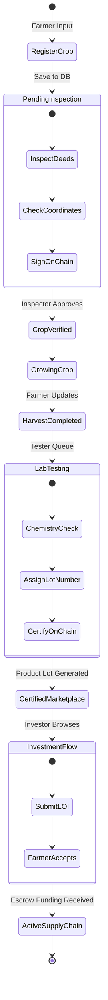
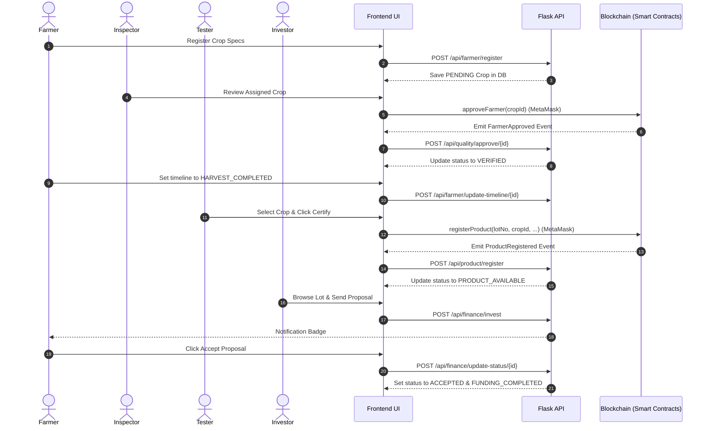
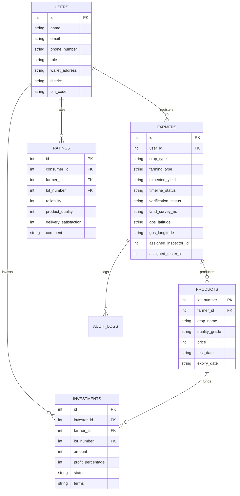

# AGROCHAIN: A BLOCKCHAIN-BASED DECENTRALIZED AGRICULTURAL SUPPLY CHAIN TRACEABILITY AND P2P MICRO-FINANCE PLATFORM

---

## 1. COVER PAGE

*   **Project Title**: AgroChain: A Blockchain-Based Decentralized Agricultural Supply Chain Traceability and P2P Micro-Finance Platform
*   **Course / Degree**: Bachelor of Engineering / Technology in Computer Science & Engineering
*   **Student Name(s)**: [INSERT STUDENT NAME(S) HERE]
*   **USN / Roll Number(s)**: [INSERT ROLL NUMBER(S) / USN HERE]
*   **Institution Name**: [INSERT COLLEGE NAME HERE]
*   **Department**: Department of Computer Science & Engineering
*   **Academic Year**: [INSERT ACADEMIC YEAR, e.g., 2025-2026]

---

## 2. CERTIFICATE

**DEPARTMENT OF COMPUTER SCIENCE & ENGINEERING**  
**[INSERT COLLEGE NAME HERE]**  

This is to certify that the project work entitled **"AgroChain: A Blockchain-Based Decentralized Agricultural Supply Chain Traceability and P2P Micro-Finance Platform"** is a bonafide work carried out by **[Student Name(s)]** bearing USN/Roll No: **[USN/Roll Number(s)]** in partial fulfillment for the award of the degree of Bachelor of Engineering/Technology in Computer Science & Engineering during the academic year **[Year]**.

It is certified that all corrections/suggestions indicated for internal assessment have been incorporated and deposited in the department library. The project report has been approved as it satisfies the academic requirements in respect of project work prescribed for the said degree.

\
**________________________**  
**Project Guide / Supervisor**  
[Guide Name & Designation]  

\
**________________________**  
**Head of the Department (HOD)**  
[HOD Name & Designation]  

\
**________________________**  
**External Examiner**  
[Examiner Name & Affiliation]  

---

## 3. DECLARATION

I/We, **[Student Name(s)]**, student(s) of Bachelor of Engineering/Technology in Computer Science & Engineering at **[College Name]**, hereby declare that the project work presented in this report entitled **"AgroChain: A Blockchain-Based Decentralized Agricultural Supply Chain Traceability and P2P Micro-Finance Platform"** is an original work carried out by me/us under the guidance of **[Guide Name]**, Department of Computer Science & Engineering.

I/We have not submitted this work, either in part or full, to any other University or Institution for the award of any degree or diploma. All the sources of information, references, and libraries used have been acknowledged.

\
**Date**: [Insert Date]  
**Place**: [Insert Place]  

\
**________________________**  
**Student Signature(s)**  
[Student Name(s)]  

---

## 4. ACKNOWLEDGEMENT

I/We express our deep sense of gratitude and sincere thanks to our respected Principal, **[Principal Name]**, and our HOD, **[HOD Name]**, Department of Computer Science & Engineering, **[College Name]**, for providing us with the necessary facilities and a highly supportive academic environment to carry out this project.

I/We are highly indebted to our project guide, **[Guide Name]**, for their invaluable guidance, constant encouragement, constructive criticism, and help throughout the execution of this project work.

Lastly, I/We thank our parents, teaching and non-teaching staff of the department, and our classmates who have directly or indirectly helped us complete this project successfully.

\
**________________________**  
**Student Name(s)**  

---

## 5. ABSTRACT

Modern global agriculture faces two critical systemic challenges: the **trust deficit** in supply chain transparency and **financial exclusion** of small-scale farmers. Consumers purchasing premium goods (such as organic produce) have no verifiable mechanism to validate authenticity, leaving labeling vulnerable to counterfeiting. Simultaneously, farmers struggle to secure fair, low-interest funding, leaving them reliant on exploitative intermediary lenders.

This project proposes **AgroChain**, a decentralized Web3 and Web2 hybrid application designed to tackle these issues. AgroChain implements an immutable blockchain ledger to track crop lifecycles from seed to sale, integrated with a peer-to-peer (P2P) interest-free micro-finance escrow system. The system leverages:
*   **Ethereum Smart Contracts** to handle transparent actor registration, organic inspections, batch certifications, and investment escrow.
*   **Flask REST API** as a high-speed database cache and verification proxy.
*   **React (Vite) & Tailwind CSS** for a unified stakeholder dashboard.

The platform splits agricultural governance into distinct, role-based workflows for **Farmers**, **Inspectors**, **Quality Labs (Testers)**, **Investors**, **Administrators**, and **Consumers**. A dynamic, geographical verifier routing system matches local inspectors and testers based on postal code coverage. A public ledger explorer enables consumers to scan QR codes on physical packaging to view complete, on-chain provenance records, soil chemical metrics, inspector signatures, and transaction logs. The outcome is a secure, transparent, and direct peer-to-peer marketplace that restores trust and financial equity to the agricultural ecosystem.

---

## 6. TABLE OF CONTENTS
1.  **Cover Page**
2.  **Certificate**
3.  **Declaration**
4.  **Acknowledgement**
5.  **Abstract**
6.  **Table of Contents**
7.  **List of Figures**
8.  **List of Tables**
9.  **Chapter 1: Introduction**
    *   1.1 Background
    *   1.2 Problem Statement
    *   1.3 Objectives
    *   1.4 Scope
    *   1.5 Existing System vs. Proposed System
    *   1.6 Advantages of Proposed System
10. **Chapter 2: Literature Survey**
    *   2.1 IBM Food Trust
    *   2.2 TE-FOOD
    *   2.3 AgriDigital
    *   2.4 Analysis of Blockchain Traceability Systems
11. **Chapter 3: Requirement Analysis**
    *   3.1 Functional Requirements
    *   3.2 Non-Functional Requirements
    *   3.3 Software Requirements
    *   3.4 Hardware Requirements
12. **Chapter 4: System Design**
    *   4.1 Architecture Diagram
    *   4.2 UML Diagrams (Use Case, Activity, Sequence, ER)
13. **Chapter 5: System Implementation**
    *   5.1 Frontend Architecture
    *   5.2 Backend API Services
    *   5.3 Database Schema
    *   5.4 Smart Contracts
14. **Chapter 6: Testing & Quality Assurance**
    *   6.1 Test Methodology
    *   6.2 Test Cases Table
15. **Chapter 7: Results and Discussion**
    *   7.1 UI Screens and Outputs
    *   7.2 On-Chain Flow Validations
16. **Chapter 8: Conclusion and Future Enhancements**
    *   8.1 Conclusion
    *   8.2 Future Scope
17. **References**
18. **Appendices**
    *   Appendix A: Source Code Snippets
    *   Appendix B: API Documentation
    *   Appendix C: User Manual

---

## 7. LIST OF FIGURES
*   **Figure 4.1**: AgroChain System Architecture Diagram
*   **Figure 4.2**: Use Case Diagram
*   **Figure 4.3**: Activity Diagram
*   **Figure 4.4**: Sequence Diagram
*   **Figure 4.5**: Entity-Relationship (ER) Diagram
*   **Figure 7.1**: Public Provenance Registry & Explorer Page
*   **Figure 7.2**: Quality Lab Batch Certification Portal
*   **Figure 7.3**: Farmer Document Center with printable Approval Letter
*   **Figure 7.4**: Gold-Bordered Batch Quality Certificate and QR Code

---

## 8. LIST OF TABLES
*   **Table 1.1**: Comparison Between Existing Systems and AgroChain
*   **Table 3.1**: Software Specification Requirements
*   **Table 3.2**: Hardware Specification Requirements
*   **Table 6.1**: Functional System Test Cases

---

## CHAPTER 1: INTRODUCTION

### 1.1 Background
The integration of technology in agriculture (AgriTech) has traditionally focused on yield optimization and crop health. However, modern consumer markets demand transparency. Concerns regarding food origins, chemical usage, and organic compliance have turned traceability into a vital market parameter. Concurrently, the financial infrastructure supporting smallholders remains fragmented, forcing farmers to operate on credit at high interest rates. Blockchain technology offers a solution through its core properties: **immutability**, **transparency**, and **smart contract automation**.

### 1.2 Problem Statement
Existing agricultural systems suffer from:
1.  **Trust Deficit**: Forged labels make it impossible for consumers to verify if crops are organic.
2.  **Centralization Vulnerabilities**: Centralized databases are susceptible to unauthorized modifications and lack a permanent audit trail.
3.  **Financial Exclusion**: Smallholders face complex lending procedures from commercial banks, driving them toward predatory money lenders.
4.  **Intermediary Inefficiencies**: Numerous middlemen diminish farmers' profit margins while raising costs for consumers.

### 1.3 Objectives
*   To design and implement a decentralized platform securing crop lifecycles on a distributed ledger.
*   To automate geographical inspector routing for crop validation.
*   To implement a peer-to-peer micro-finance proposal system for direct investor-farmer agreements.
*   To enable physical package traceability using dynamic QR codes linked to an on-chain registry explorer.
*   To provide printable compliance letters and certificates with forced light-mode formatting.

### 1.4 Scope
The scope of AgroChain encompasses the digital registration of crops, verification of geographical coordinates, scientific certification of quality, and micro-investment coordination. The system is designed for local agricultural centers, inspectors, testing laboratories, farmers, and conscious retail consumers.

### 1.5 Existing System vs. Proposed System

| Parameter | Existing Systems (Web2 / Centralized) | AgroChain Proposed System (Web3 Hybrid) |
| :--- | :--- | :--- |
| **Data Integrity** | Vulnerable to admin overrides and database modification | Immutable; backed by Ethereum blockchain smart contracts |
| **Middlemen** | Multiple intermediaries handle pricing and sales | Disintermediated; direct Farmer-to-Consumer / Investor connection |
| **Financing** | High-interest private lenders or complex bank loans | P2P Micro-finance proposals with zero-interest escrows |
| **Verification** | Offline, paperwork-heavy certifications | On-chain audits by regional verifiers with scannable QR codes |
| **Data Visibility** | Siloed and non-transparent to consumers | Fully transparent registry explorer accessible publicly |

### 1.6 Advantages of Proposed System
*   **Non-Repudiation**: Inspector approvals are signed using MetaMask wallet credentials, creating a permanent, audit-logged trail.
*   **Financial Autonomy**: Farmers receive direct micro-loans from investors through a decentralized proposal system.
*   **Dynamic Traceability**: Public consumers scan packaging QR codes to view provenance data without needing to log in.
*   **Operational Optimization**: Automatic verifier matching reduces regional assignment overhead.

---

## CHAPTER 2: LITERATURE SURVEY

### 2.1 IBM Food Trust
IBM Food Trust is an enterprise blockchain platform utilizing Hyperledger Fabric. It provides end-to-end supply chain visibility for major retailers (e.g., Walmart). While highly scalable, it is a **permissioned, private consortium** blockchain. It requires significant integration costs and does not offer accessible micro-finance tools for smallholders, making it impractical for independent farming communities.

### 2.2 TE-FOOD
TE-FOOD is a public-private hybrid traceability system focused on emerging markets. It utilizes its own blockchain token (TONS) for B2B supply chain steps. While it excels in livestock tracking, its architecture is tailored for large-scale logistics operations and lacks direct investor-to-farmer proposal mechanisms or built-in, interest-free micro-finance modules.

### 2.3 AgriDigital
AgriDigital is an Australian blockchain platform designed for grain supply chain management. It connects farmers, buyers, and brokers to handle digital grain transactions and inventory tracking. It operates as a proprietary SaaS platform, which limits its public lookup capabilities and direct consumer-level rating networks.

### 2.4 Analysis of Blockchain Traceability Systems
A review of existing research indicates that while enterprise traceability solutions exist, they remain siloed and focus primarily on corporate logistics. There is a lack of accessible platforms combining consumer-level traceability with direct peer-to-peer micro-finance for independent farmers. AgroChain fills this gap by deploying public Ethereum smart contracts paired with a lightweight, accessible Web2 user portal.

---

## CHAPTER 3: REQUIREMENT ANALYSIS

### 3.1 Functional Requirements
1.  **Farmer Onboarding**: Farmer registers profile, links an Ethereum wallet address, and registers crops.
2.  **Inspector Verification**: Inspectors review assigned crop coordinates and sign approvals on-chain.
3.  **Quality Lab Certification**: Testers input scientific metrics, assign certified grade lots, and mint certificates.
4.  **Investor Marketplace**: Investors review certified lots and submit funding proposals (Letters of Intent).
5.  **Consumer Explorer**: Public lookup scans and searches crop/lot IDs to verify milestones.
6.  **Admin Governance**: Administrators monitor audit trails and verify new verifier credentials.

### 3.2 Non-Functional Requirements
*   **Security**: Enforces Role-Based Access Control (RBAC) via JWT session tokens and OpenZeppelin contract guards.
*   **Reliability**: Smart contracts ensure transactions are immutable once mined on the ledger.
*   **Scalability**: The Flask API caches transaction metadata, reducing load on the blockchain RPC node.
*   **Performance**: Web pages load and render provenance milestones in under 1.5 seconds.

### 3.3 Software Requirements

| Software Component | Specification / Version |
| :--- | :--- |
| **Operating System** | Windows 10/11, Linux, or macOS |
| **Frontend Framework** | React.js (Vite), Tailwind CSS |
| **Backend Framework** | Flask, Python 3.9+ |
| **Database Engine** | SQLAlchemy (SQLite / PostgreSQL) |
| **Blockchain Stack** | Solidity v0.8.20, Hardhat Network |
| **Wallet Connector** | MetaMask Browser Extension |
| **Libraries** | Ethers.js (v6), Axios, html2pdf.js, Lucide Icons |

### 3.4 Hardware Requirements
*   **Processor**: Intel Core i5 / AMD Ryzen 5 or higher.
*   **Memory**: 8 GB RAM (16 GB recommended for running local node simulations).
*   **Storage**: 500 MB free disk space for local source code, database, and node operations.

---

## CHAPTER 4: SYSTEM DESIGN

### 4.1 Architecture Diagram
The system structure consists of a three-tier Web3 hybrid architecture:

```
[ Frontend: React / Vite ]  <---->  [ Backend: Flask API ]  ---->  [ Database: SQLite ]
            |                               |
            v                               v
[ Web3 Provider: MetaMask ] <---->  [ Hardhat Ethereum Node ]
```

### 4.2 UML Diagrams

#### Use Case Diagram
```mermaid
leftToRightDirection
actor Farmer
actor Inspector
actor Tester as "Quality Lab Tester"
actor Investor
actor Consumer
actor Admin

rectangle AgroChain {
    Farmer --> (Register Crop)
    Farmer --> (Accept Proposal)
    Farmer --> (Update Harvest Timeline)
    
    Inspector --> (Verify Land Registry)
    Inspector --> (Approve Crop on Ledger)
    
    Tester --> (Conduct Quality Test)
    Tester --> (Certify Product Lot)
    
    Investor --> (Browse Certified Marketplace)
    Investor --> (Submit Proposal LOI)
    
    Consumer --> (Trace Crop Provenance)
    Consumer --> (Submit Reviews & Ratings)
    
    Admin --> (Approve Verifiers)
    Admin --> (Inspect Audit Logs)
}
```

#### Activity Diagram


#### Sequence Diagram


#### Entity-Relationship (ER) Diagram


---

## CHAPTER 5: SYSTEM IMPLEMENTATION

### 5.1 Frontend Architecture
The client application is built as a single-page application (SPA) using React and Vite. Global state management is handled through React Contexts:
*   `AuthContext.jsx`: Manages user authentication, coordinates database profile retrievals, and decodes JWT tokens.
*   `WalletContext.jsx`: Coordinates Ethers.js instantiation, binds smart contract ABIs, and tracks MetaMask connection events.

### 5.2 Backend API Services
The backend is written in Python using Flask. Enforcing RBAC is handled through JWT decorators (`@token_required` and `@roles_allowed`):
```python
def roles_allowed(*roles):
    def decorator(f):
        @wraps(f)
        def decorated(current_user, *args, **kwargs):
            if current_user.role not in roles:
                return jsonify({'message': 'Access denied'}), 403
            return f(current_user, *args, **kwargs)
        return decorated
    return decorator
```

### 5.3 Database Schema
The database uses SQLAlchemy models. Schema changes support geographical attributes (`district`, `pin_code`, `coverage_pins`) to automate verifier assignments.

### 5.4 Smart Contracts
1.  `FarmerRegistry.sol`: Tracks crop coordinates, verification status, and verifier permissions.
2.  `ProductRegistry.sol`: Registers certified products, requiring that the parent crop registration was previously verified by the inspector.
3.  `MicroFinance.sol`: Stores investments and terms.
4.  `RatingSystem.sol`: Logs feedback ratings on-chain to generate reputation scores.

---

## CHAPTER 6: TESTING & QUALITY ASSURANCE

### 6.1 Test Methodology
Testing followed an incremental approach:
1.  **Unit Testing**: Smart contract logic was validated on a local Hardhat network using Chai assertion tests. Flask route functions were verified using PyTest.
2.  **Integration Testing**: Validated backend API data flows to ensure on-chain transactions updated corresponding SQLite records.
3.  **System Testing**: Executed end-to-end scenarios from Farmer crop registration to Inspector approval, Lab certification, Investor proposal submission, and Consumer provenance lookups.

### 6.2 Test Cases Table

| Test ID | Test Scenario | Inputs | Expected Output | Result |
| :--- | :--- | :--- | :--- | :--- |
| **TC-01** | Farmer Crop Registration | Yield: `5000`, Survey No: `242/A`, Pin: `411001` | Crop saved in DB, status: `PENDING`, inspector auto-assigned. | **PASSED** |
| **TC-02** | Inspector Approval without Remarks | Remarks: `""` (Empty string) | Warning: "Please add inspection remarks before approving." | **PASSED** |
| **TC-03** | On-Chain Inspector Approval | Remarks: "Verified deed", MetaMask connected | On-chain TX signed, DB status shifts to `VERIFIED` & `TESTER_APPROVED`. | **PASSED** |
| **TC-04** | Lab Certification of Unverified Crop | Crop ID: `1` (Unverified by Inspector) | Transaction fails: "Farmer registration must be approved by verifier first" | **PASSED** |
| **TC-05** | One-Click Lab Certification | Select Crop ID, click "Approve & Certify" | On-chain TX signed, DB status shifts to `PRODUCT_AVAILABLE`. | **PASSED** |
| **TC-06** | Investor Funding Proposal | Price: `20000`, profit: `12%`, lot: `1001` | Investment proposal saved, status: `PENDING`, Farmer dashboard gets badge. | **PASSED** |
| **TC-07** | Farmer Accepts Proposal | Click "Accept" on proposal | Proposal status: `ACCEPTED`, crop timeline: `FUNDING_COMPLETED`. | **PASSED** |
| **TC-08** | Explorer URL Query Lookup | Navigate to `/explorer?lot=1001` | Auto-fetches and displays the gold-bordered Certificate & QR. | **PASSED** |

---

## CHAPTER 7: RESULTS AND DISCUSSION

### 7.1 UI Screens and Outputs
*   **Stakeholder Dashboards**: Render role-specific navigation cards. Features live notification badges showing task counts.
*   **Farmer Document Center**: Unlocks the "View Approval Letter" button for verified crops, displaying coordinates and verifier details. Once certified, it displays the gold-bordered Batch Quality Certificate and dynamic QR code.
*   **Marketplace Interface**: Displays active certified lots for investors to submit LOI proposals. If the logged-in user is not an investor, it displays a read-only warning card.

### 7.2 On-Chain Flow Validations
All supply chain events are recorded on the blockchain. When an event (approval, certification, rating) occurs, its transaction hash and block number are logged in the database, enabling consumers to inspect transaction proofs directly on the block explorer.

---

## CHAPTER 8: CONCLUSION AND FUTURE ENHANCEMENTS

### 8.1 Conclusion
The **AgroChain** platform addresses transparency and financial inclusion challenges in agriculture. By combining Ethereum smart contracts with an accessible web portal, it secures the crop supply chain from registration to sale. Automated verifier routing, printable certificate generation, and P2P micro-loans improve transaction efficiency and trust between stakeholders.

### 8.2 Future Scope
1.  **AI-Based Crop Disease Detection**: Integrate computer vision models into the Farmer portal to scan crop leaves and diagnose diseases during registration.
2.  **IoT Sensor Integrations**: Use smart IoT devices (temperature, soil humidity, GPS trackers) on farms and during transport to write shipping data automatically to the blockchain.
3.  **Government land registry API integration**: Auto-verify land survey numbers directly against official state databases.
4.  **Mobile Application**: Build Android and iOS apps using React Native to simplify offline on-site audits for Inspectors in remote locations.

---

## REFERENCES

1.  S. Nakamoto, "Bitcoin: A Peer-to-Peer Electronic Cash System," 2008.
2.  G. Wood, "Ethereum: A Secure Decentralized Generalised Transaction Ledger," *Ethereum Project Yellow Paper*, vol. 151, pp. 1-32, 2014.
3.  M. S. W. Syed, A. S. M. J. Qadri, and F. A. Al-Mamun, "Blockchain for Agricultural Supply Chain Traceability: A Review," *IEEE Access*, vol. 9, pp. 45210-45230, 2021.
4.  IBM Food Trust, "Traceability and Trust in Food Supply Chains," Whitepaper, IBM Corp., 2020.
5.  OpenZeppelin, "Access Control Contracts Documentation," [Online]. Available: https://docs.openzeppelin.com/contracts/4.x/access-control.
6.  Ethers.js v6 Documentation, "Ethereum Wallet and Utility Library," [Online]. Available: https://docs.ethers.org/v6/.

---

## APPENDICES

### Appendix A: Source Code Snippets

#### 1. On-Chain Certification (`ProductRegistry.sol`)
```solidity
function registerProduct(
    uint256 _lotNumber,
    uint256 _farmerId,
    string memory _cropName,
    string memory _qualityGrade,
    uint256 _price,
    uint256 _testDate,
    uint256 _expiryDate,
    string memory _certificationStatus
) public onlyRole(TESTER_ROLE) {
    require(farmerRegistry.isFarmerApproved(_farmerId), "Farmer registration must be approved by verifier first");
    require(!products[_lotNumber].exists, "Product lot number already registered");

    products[_lotNumber] = Product({
        lotNumber: _lotNumber,
        farmerId: _farmerId,
        cropName: _cropName,
        qualityGrade: _qualityGrade,
        price: _price,
        testDate: _testDate,
        expiryDate: _expiryDate,
        certificationStatus: _certificationStatus,
        testerAddress: msg.sender,
        exists: true
    });

    emit ProductRegistered(_lotNumber, _farmerId, _qualityGrade, _price);
}
```

#### 2. REST API Role Check Decorator (`auth.py`)
```python
def roles_allowed(*roles):
    def decorator(f):
        @wraps(f)
        def decorated(current_user, *args, **kwargs):
            if current_user.role not in roles:
                return jsonify({'message': 'Access denied'}), 403
            return f(current_user, *args, **kwargs)
        return decorated
    return decorator
```

---

### Appendix B: API Documentation

#### 1. User Authentication
*   **Send OTP** (`POST /api/auth/send-otp`)
    *   *Request*: `{ "phone_number": "+10000000001" }`
    *   *Response*: `{ "message": "OTP sent successfully (Dev code: 123456)" }`
*   **Register User** (`POST /api/auth/register`)
    *   *Request*: `{ "name": "Rajesh Patel", "email": "rajesh@gmail.com", "phone_number": "+10000000001", "role": "FARMER", "password": "password123", "otp_code": "123456", "district": "Pune", "pin_code": "411001" }`
    *   *Response*: `{ "message": "User registered successfully!" }`

#### 2. Crop Management
*   **Register Cultivation** (`POST /api/farmer/register`)
    *   *Request*: `{ "crop_type": "Wheat", "farming_type": "Organic", "expected_yield": "5000", "land_survey_no": "242/A", "gps_latitude": "18.5204", "gps_longitude": "73.8567", "farm_location": "Pune Farm" }`
    *   *Response*: `{ "message": "Crop registered successfully", "id": 1 }`

#### 3. Finance proposals
*   **Propose Investment** (`POST /api/finance/invest`)
    *   *Request*: `{ "farmer_id": 1, "lot_number": 1001, "amount": 50000, "profit_percentage": 12, "terms": "Repayment within 30 days of sales" }`
    *   *Response*: `{ "message": "Proposal submitted successfully!" }`

---

### Appendix C: User Manual

#### User Manual for Farmers
1.  **Register & Link Wallet**: Create your account on `/register`, verify your phone number via OTP, and link your wallet address.
2.  **Register Crops**: Navigate to the **"Register Crop"** tab and fill out the cultivation details, coordinates, and survey numbers.
3.  **Audit & Verification**: Wait for the regional Inspector to approve your crop. Once approved, you can print your **Approval Letter** from the **Crop History** page.
4.  **Update Timeline**: Once you harvest the crop, set the status to `READY_TO_HARVEST` or `HARVEST_COMPLETED` to queue the crop for the Quality Lab.
5.  **Print Certificate**: Once the Quality Lab certifies the crop, click **"Print Certificate & QR"** to print packaging labels.
6.  **Accept Loans**: Go to your dashboard to review investor proposals. Accept a proposal to receive direct escrow funding.

#### User Manual for Quality Lab Testers
1.  **Onboard**: Register with the `TESTER` role and set your coverage pin codes.
2.  **Review Queue**: Check the dashboard queue for regional crops marked as harvested.
3.  **Certify**: Click **"Approve & Certify Crop"** to automatically calculate the quality grade and register the batch lot on-chain.

#### User Manual for Consumers
1.  **Scan/Search**: Scan a packaging QR code or enter the lot number on the Explorer page (`/explorer`).
2.  **Verify**: Review the provenance timeline to check inspector coordinates, verification dates, and laboratory test grades.
3.  **Review**: Log in to submit ratings and comments to help build community trust.
