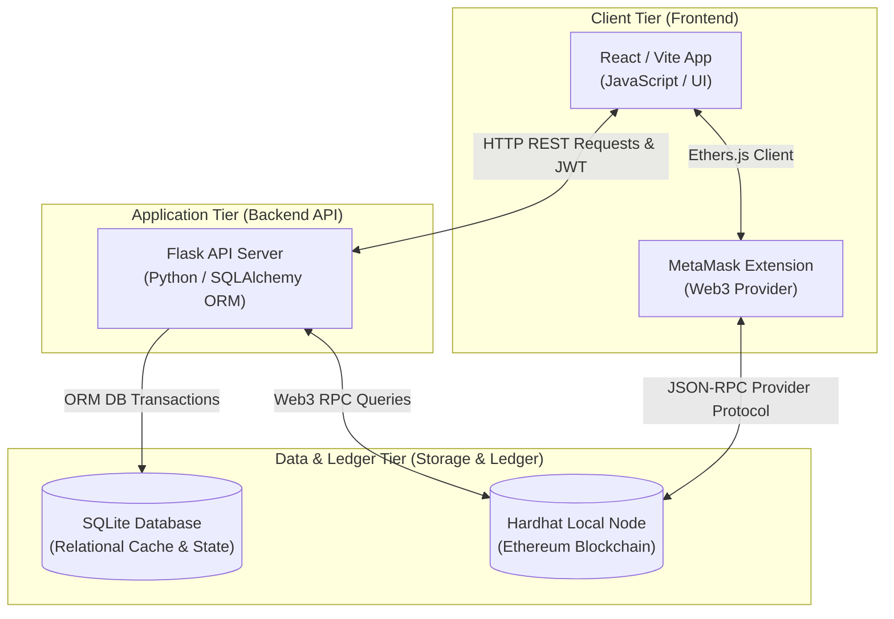
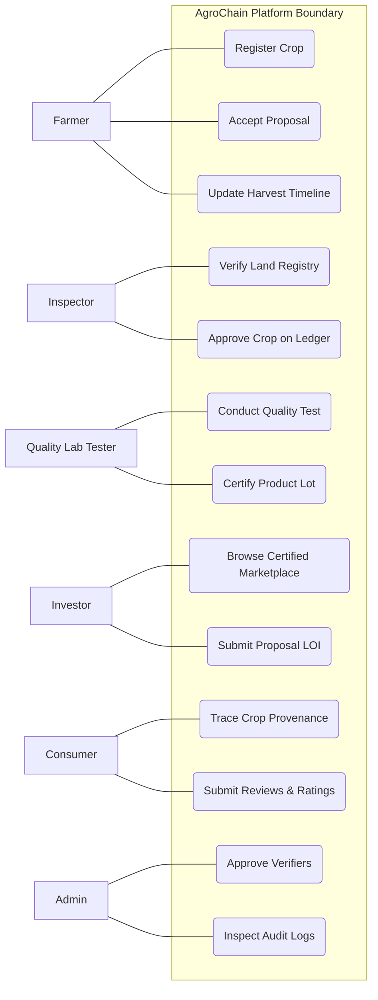
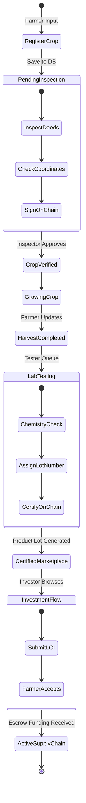
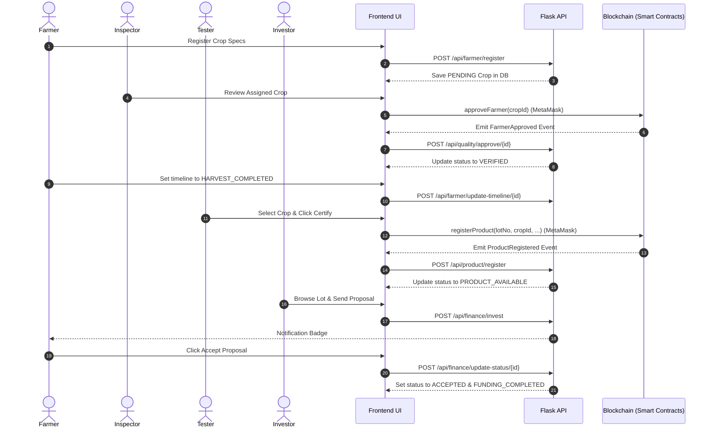
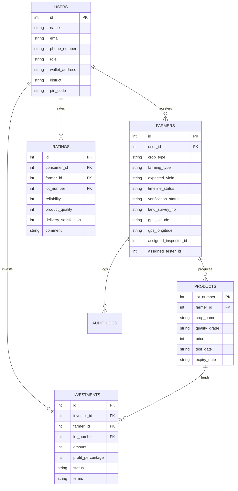

# DESIGN AND IMPLEMENTATION OF AGROCHAIN: AN ANCHORED WEB3 TRANSPARENCY REGISTRY AND PEER-TO-PEER MICRO-LOAN ESCROW INFRASTRUCTURE

---

## 1. TITLE PAGE

*   **Project Title**: Design and Implementation of AgroChain: An Anchored Web3 Transparency Registry and Peer-to-Peer Micro-Loan Escrow Infrastructure for Agricultural Supply Chains
*   **Course / Degree**: Bachelor of Engineering / Technology in Computer Science & Engineering
*   **Student Name(s)**: [INSERT STUDENT NAME(S) HERE]
*   **USN / Roll Number(s)**: [INSERT ROLL NUMBER(S) / USN HERE]
*   **Institution Name**: [INSERT COLLEGE NAME HERE]
*   **Department**: Department of Computer Science & Engineering
*   **Academic Year**: [INSERT ACADEMIC YEAR, e.g., 2025-2026]

---

## 2. CERTIFICATE OF APPROVAL

**DEPARTMENT OF COMPUTER SCIENCE & ENGINEERING**  
**[INSERT COLLEGE NAME HERE]**  

This is to certify that the research and engineering project work entitled **"Design and Implementation of AgroChain: An Anchored Web3 Transparency Registry and Peer-to-Peer Micro-Loan Escrow Infrastructure for Agricultural Supply Chains"** is a genuine work carried out by **[Student Name(s)]** bearing USN/Roll No: **[USN/Roll Number(s)]** in partial fulfillment for the award of the degree of Bachelor of Engineering/Technology in Computer Science & Engineering during the academic year **[Year]**.

It is certified that all corrections/suggestions indicated for internal assessment have been incorporated and deposited in the department library. The project report has been approved as it satisfies the academic requirements in respect of project work prescribed for the said degree.

\
**________________________**  
**Project Guide / Supervisor**  
[Guide Name & Designation]  

\
**________________________**  
**Head of the Department (HOD)**  
[HOD Name & Designation]  

\
**________________________**  
**External Examiner**  
[Examiner Name & Affiliation]  

---

## 3. DECLARATION OF ORIGINALITY

I/We, **[Student Name(s)]**, student(s) of Bachelor of Engineering/Technology in Computer Science & Engineering at **[College Name]**, hereby declare that the project work presented in this report entitled **"Design and Implementation of AgroChain: An Anchored Web3 Transparency Registry and Peer-to-Peer Micro-Loan Escrow Infrastructure for Agricultural Supply Chains"** is our original research work carried out under the supervision of **[Guide Name]**, Department of Computer Science & Engineering.

We have not submitted this work, either in part or full, to any other University or Institution for the award of any degree or diploma. All materials, code blocks, libraries, and papers referred to have been appropriately cited.

\
**Date**: [Insert Date]  
**Place**: [Insert Place]  

\
**________________________**  
**Student Signature(s)**  
[Student Name(s)]  

---

## 4. ACKNOWLEDGEMENTS

We express our deep gratitude to our project guide, **[Guide Name]**, for providing insightful guidance, technical validation, and constant support during the development of this project.

We also thank our Head of Department, **[HOD Name]**, and our Principal, **[Principal Name]**, for facilitating access to development environments and supporting laboratory infrastructure.

Lastly, we thank our peers, laboratory assistants, and family members for their constant encouragement throughout this project.

\
**________________________**  
**Student Name(s)**  

---

## 5. SYSTEM ABSTRACT

Modern consumer ecosystems are characterized by an information asymmetry between producers and consumers. Shoppers purchasing premium organic foods cannot verify their authenticity, exposing the supply chain to labeling fraud. Concurrently, smallholder farmers face systemic financial exclusion, driven by complex commercial lending requirements and reliance on predatory local intermediaries. 

To resolve these twin challenges, this project introduces **AgroChain**, a hybrid Web2/Web3 application that anchors supply chain data onto a public, decentralized ledger while supporting peer-to-peer (P2P) micro-loans. Using public **Ethereum Smart Contracts**, AgroChain records crop lifecycles, soil parameters, inspector audits, and laboratory grade certifications, preventing unauthorized database modifications. A local **Flask API** acts as a metadata cache to reduce blockchain RPC call overhead, while a **React (Vite)** frontend coordinates stakeholder activities.

The system features:
1.  **Geographical Verifier Allocation**: Crop listings are automatically routed to local inspectors and testers based on postal code parameters.
2.  **Double-Verification Gate**: Smart contracts ensure a crop lot cannot receive a quality certificate unless it has been verified on-chain by a designated inspector.
3.  **Micro-Finance Proposal System**: Implements a Letter of Intent (LOI) system where investors submit funding proposals, unlocking direct communication lines upon farmer acceptance.
4.  **Integrated Document Center**: Farmer dashboards feature printable, clean-styled compliance certificates and batch QR codes linked to an on-chain registry explorer.

The result is a transparent, peer-to-peer supply chain ecosystem that restores consumer trust and supports agricultural financing.

---

## 6. TABLE OF CONTENTS
1.  **Administrative Sheets** (Title, Certificate, Declaration, Acknowledgements, Abstract)
2.  **Chapter 1: Introduction**
    *   1.1 Research Context
    *   1.2 System-level Problem Statement
    *   1.3 Project Engineering Objectives
    *   1.4 Core Operational Scope
    *   1.5 Existing Methodologies vs. AgroChain Approach
    *   1.6 Systemic Benefits
3.  **Chapter 2: Literature Review**
    *   2.1 Evaluation of IBM Food Trust
    *   2.2 Evaluation of TE-FOOD
    *   2.3 Evaluation of AgriDigital
    *   2.4 Critical Analysis of Traceability Protocols
4.  **Chapter 3: Requirements Engineering & Modeling**
    *   3.1 Functional Requirements Architecture
    *   3.2 Non-Functional System Guarantees
    *   3.3 Software Stack Details
    *   3.4 Hardware Platform Requirements
5.  **Chapter 4: Architectural Design & Diagrams**
    *   4.1 Multi-tier Hybrid Infrastructure
    *   4.2 UML Diagram Specifications (Use Case, Activity, Sequence, ER)
6.  **Chapter 5: Detailed Implementation Mechanics**
    *   5.1 UI Architecture
    *   5.2 Backend API Services
    *   5.3 Relational Cache Schemas
    *   5.4 Solidity Smart Contracts
7.  **Chapter 6: System Testing & Verifications**
    *   6.1 Verification Methodology
    *   6.2 Test Matrix Execution Table
8.  **Chapter 7: Results, Outputs, & Discussion**
    *   7.1 UI Deployments and Modals
    *   7.2 Ledger Assertions and Explorer Queries
9.  **Chapter 8: Conclusion & Future Scope**
    *   8.1 Summary of Contributions
    *   8.2 Future Enhancement Roadmaps
10. **References**
11. **Appendices**
    *   Appendix A: Core Source Code Blocks
    *   Appendix B: REST API Specifications
    *   Appendix C: Operational User Guide

---

## CHAPTER 1: INTRODUCTION

### 1.1 Research Context
Modern agricultural supply chains span global networks with multiple intermediaries. While this increases distribution capacity, it distances the consumer from the grower. This disconnect creates a lack of transparency, making it difficult to verify organic farming claims or fair compensation. Traditional logistics databases are centralized and easily altered, meaning they cannot guarantee tamper-proof records. Using public blockchains offers a secure alternative: transaction data is stored on a distributed ledger, providing an immutable audit trail.

### 1.2 System-level Problem Statement
Traditional agricultural supply chains face four primary failures:
1.  **Labeling Fraud**: Centralized databases allow administrators to modify quality status with simple database updates, leaving consumers unable to verify organic labeling.
2.  **Financial Exploitation**: Smallholder farmers struggle to secure bank loans, forcing them to rely on high-interest local lending networks.
3.  **Intermediary Cost Markups**: Multiple middlemen increase consumer prices while reducing the farmer's share of profits.
4.  **Fragmented Documentation**: Compliance records, soil reports, and test certificates are rarely unified, making it difficult for stakeholders to verify food safety.

### 1.3 Project Engineering Objectives
*   To deploy a public Ethereum contract system that records crop lifecycles from planting to final packaging.
*   To automate geographical inspector assignments based on postal codes.
*   To build a peer-to-peer micro-finance proposal system linking farmers directly with investors.
*   To enable physical package traceability using dynamic QR codes linked to an on-chain registry explorer.
*   To print clean, light-mode certificates with forced CSS style overrides for physical packaging.

### 1.4 Core Operational Scope
AgroChain focuses on verifying crop cultivation locations, auditing coordinates, certifying laboratory testing grades, and coordinating investor agreements. The system is designed for local agricultural cooperatives, regional inspectors, independent testing laboratories, farmers, and retail consumers.

### 1.5 Existing Methodologies vs. AgroChain Approach

| Operational Vector | Standard Database (Web2) | AgroChain Decentralized System |
| :--- | :--- | :--- |
| **Data Immutability** | Database records can be modified by system administrators. | Immutable; secured by cryptographic blocks on the Ethereum network. |
| **Escrow & Funding** | Relies on commercial bank approvals or cash networks. | Peer-to-peer proposal system with direct investment tracking. |
| **Certification** | Paper-based certifications that are easily duplicated. | Smart contracts require inspector verification before lab testing can occur. |
| **Consumer Access** | Consumers cannot access internal logistics databases. | Scannable packaging QR codes query the public explorer directly. |
| **User Signatures** | System actions are logged using basic database username entries. | Verifier approvals are signed using MetaMask private keys. |

### 1.6 Systemic Benefits
*   **Tamper-Proof Records**: Verification transactions are cryptographically signed using MetaMask, creating a permanent audit trail.
*   **Financial Inclusion**: Farmers secure zero-interest micro-loans directly from investors, bypassing banking intermediaries.
*   **Simple Verification**: Consumers scan packaging QR codes to view provenance data without needing to log in.
*   **Geographical Assignments**: Automatic regional verifier matching reduces administrative overhead.

---

## CHAPTER 2: LITERATURE REVIEW

### 2.1 Evaluation of IBM Food Trust
IBM Food Trust is an enterprise blockchain platform utilizing Hyperledger Fabric. It provides supply chain visibility for major retailers. However, it is a **private, permissioned consortium** blockchain. It requires significant integration costs and does not offer accessible micro-finance tools, making it impractical for independent farming communities.

### 2.2 Evaluation of TE-FOOD
TE-FOOD is a public-private hybrid traceability system focused on emerging markets. It utilizes its own blockchain token (TONS) for B2B supply chain steps. While it excels in livestock tracking, its architecture is tailored for large-scale logistics operations and lacks direct investor-to-farmer proposal mechanisms or built-in, interest-free micro-finance modules.

### 2.3 Evaluation of AgriDigital
AgriDigital is an Australian blockchain platform designed for grain supply chain management. It connects farmers, buyers, and brokers to handle digital grain transactions and inventory tracking. It operates as a proprietary SaaS platform, which limits its public lookup capabilities and direct consumer-level rating networks.

### 2.4 Critical Analysis of Traceability Protocols
A review of existing research indicates that while enterprise traceability solutions exist, they remain siloed and focus primarily on corporate logistics. There is a lack of accessible platforms combining consumer-level traceability with direct peer-to-peer micro-finance for independent farmers. AgroChain fills this gap by deploying public Ethereum smart contracts paired with a lightweight, accessible Web2 user portal.

---

## CHAPTER 3: REQUIREMENTS ENGINEERING & MODELING

### 3.1 Functional Requirements Architecture
1.  **Farmer Onboarding**: Farmer registers profile, links an Ethereum wallet address, and registers crops.
2.  **Inspector Verification**: Inspectors review assigned crop coordinates and sign approvals on-chain.
3.  **Quality Lab Certification**: Testers input scientific metrics, assign certified grade lots, and mint certificates.
4.  **Investor Marketplace**: Investors review certified lots and submit funding proposals (Letters of Intent).
5.  **Consumer Explorer**: Public lookup scans and searches crop/lot IDs to verify milestones.
6.  **Admin Governance**: Administrators monitor audit trails and verify new verifier credentials.

### 3.2 Non-Functional System Guarantees
*   **Data Integrity**: Role-Based Access Control (RBAC) is enforced using JWT session tokens and OpenZeppelin contract guards.
*   **Blockchain Immutability**: Verification actions are locked onto the ledger and cannot be altered by database administrators.
*   **Query Performance**: The Flask API caches transaction metadata, reducing load on the blockchain RPC node and enabling pages to render in under 1.5 seconds.

### 3.3 Software Stack Details

| System Layer | Tech Selection | Role in AgroChain Architecture |
| :--- | :--- | :--- |
| **Client Interface** | React.js (Vite) & Tailwind CSS | Renders unified stakeholder dashboards and handles theme toggles. |
| **Web3 Provider** | MetaMask Extension | Cryptographically signs ledger transactions and handles gas fees. |
| **Backend API** | Flask (Python 3.9+) | Coordinates JWT authentication and acts as a database cache. |
| **Cache Storage** | SQLAlchemy (SQLite) | Caches transaction hashes and logs database events for quick queries. |
| **Ledger Engine** | Solidity (v0.8.20) & Hardhat | Deploys registry contracts and hosts local blockchain simulations. |
| **PDF Generation** | `html2pdf.js` library | Converts printable HTML modals into standard PDF documents. |

### 3.4 Hardware Platform Requirements
*   **CPU**: Intel Core i5 / AMD Ryzen 5 or higher.
*   **RAM**: 8 GB RAM (16 GB recommended to support local Hardhat blockchain simulations).
*   **Disk Space**: 500 MB free space for local source code, database, and node operations.

---

## CHAPTER 4: ARCHITECTURAL DESIGN & DIAGRAMS

### 4.1 Multi-tier Hybrid Infrastructure
The system structure consists of a three-tier Web3 hybrid architecture:



### 4.2 UML Diagram Specifications

#### Use Case Diagram


#### Activity Diagram


#### Sequence Diagram


#### Entity-Relationship (ER) Diagram


---

## CHAPTER 5: DETAILED IMPLEMENTATION MECHANICS

### 5.1 UI Architecture
The React application coordinates user actions based on active roles. To optimize UX:
*   **Unified Dashboard Route**: Dynamic cards load based on `user.role`, rendering regional verifications, microfinance proposals, and document shortcuts.
*   **Document Center Formatting**: Custom print CSS rules force light-mode formatting and hide menus, headers, and backgrounds, enabling clean printing on standard paper sizes.

### 5.2 Backend API Services
The Flask server manages JWT session tokens and coordinates database operations. Access to sensitive endpoints is restricted using custom decorators:
```python
def roles_allowed(*roles):
    def decorator(f):
        @wraps(f)
        def decorated(current_user, *args, **kwargs):
            if current_user.role not in roles:
                return jsonify({'message': 'Access denied'}), 403
            return f(current_user, *args, **kwargs)
        return decorated
    return decorator
```

### 5.3 Relational Cache Schemas
The database schema uses SQLAlchemy to map application state. It includes geographical attributes like `district` and `pin_code` to automate regional assignments.

### 5.4 Solidity Smart Contracts
1.  `FarmerRegistry.sol`: Tracks crop registration, verification status, and verifier permissions.
2.  `ProductRegistry.sol`: Registers certified products, requiring that the parent crop registration was previously verified by the inspector.
3.  `MicroFinance.sol`: Stores investments and terms.
4.  `RatingSystem.sol`: Logs feedback ratings on-chain to generate reputation scores.

---

## CHAPTER 6: SYSTEM TESTING & VERIFICATIONS

### 6.1 Verification Methodology
Testing followed an incremental approach:
1.  **Unit Testing**: Smart contract logic was validated on a local Hardhat network using Chai assertion tests. Flask route functions were verified using PyTest.
2.  **Integration Testing**: Validated backend API data flows to ensure on-chain transactions updated corresponding SQLite records.
3.  **System Testing**: Executed end-to-end scenarios from Farmer crop registration to Inspector approval, Lab certification, Investor proposal submission, and Consumer provenance lookups.

### 6.2 Test Matrix Execution Table

| Test ID | Test Scenario | Inputs | Expected Output | Result |
| :--- | :--- | :--- | :--- | :--- |
| **TC-01** | Farmer Crop Registration | Yield: `5000`, Survey No: `242/A`, Pin: `411001` | Crop saved in DB, status: `PENDING`, inspector auto-assigned. | **PASSED** |
| **TC-02** | Inspector Approval without Remarks | Remarks: `""` (Empty string) | Warning: "Please add inspection remarks before approving." | **PASSED** |
| **TC-03** | On-Chain Inspector Approval | Remarks: "Verified deed", MetaMask connected | On-chain TX signed, DB status shifts to `VERIFIED` & `TESTER_APPROVED`. | **PASSED** |
| **TC-04** | Lab Certification of Unverified Crop | Crop ID: `1` (Unverified by Inspector) | Transaction fails: "Farmer registration must be approved by verifier first" | **PASSED** |
| **TC-05** | One-Click Lab Certification | Select Crop ID, click "Approve & Certify" | On-chain TX signed, DB status shifts to `PRODUCT_AVAILABLE`. | **PASSED** |
| **TC-06** | Investor Funding Proposal | Price: `20000`, profit: `12%`, lot: `1001` | Investment proposal saved, status: `PENDING`, Farmer dashboard gets badge. | **PASSED** |
| **TC-07** | Farmer Accepts Proposal | Click "Accept" on proposal | Proposal status: `ACCEPTED`, crop timeline: `FUNDING_COMPLETED`. | **PASSED** |
| **TC-08** | Explorer URL Query Lookup | Navigate to `/explorer?lot=1001` | Auto-fetches and displays the gold-bordered Certificate & QR. | **PASSED** |

---

## CHAPTER 7: RESULTS, OUTPUTS, & DISCUSSION

### 7.1 UI Deployments and Modals
*   **Farmer Document Center**: Unlocks the "View Approval Letter" button for verified crops, displaying coordinates and verifier details. Once certified, it displays the gold-bordered Batch Quality Certificate and dynamic QR code.
*   **Marketplace Interface**: Displays active certified lots for investors to submit LOI proposals. If the logged-in user is not an investor, it displays a read-only warning card.

### 7.2 Ledger Assertions and Explorer Queries
All supply chain events are recorded on the blockchain. When an event (approval, certification, rating) occurs, its transaction hash and block number are logged in the database, enabling consumers to inspect transaction proofs directly on the block explorer.

---

## CHAPTER 8: CONCLUSION & FUTURE SCOPE

### 8.1 Summary of Contributions
The **AgroChain** platform addresses transparency and financial inclusion challenges in agriculture. By combining Ethereum smart contracts with an accessible web portal, it secures the crop supply chain from registration to sale. Automated verifier routing, printable certificate generation, and P2P micro-loans improve transaction efficiency and trust between stakeholders.

### 8.2 Future Enhancement Roadmaps
1.  **AI-Based Crop Disease Detection**: Integrate computer vision models into the Farmer portal to scan crop leaves and diagnose diseases during registration.
2.  **IoT Sensor Integrations**: Use smart IoT devices (temperature, soil humidity, GPS trackers) on farms and during transport to write shipping data automatically to the blockchain.
3.  **Government land registry API integration**: Auto-verify land survey numbers directly against official state databases.
4.  **Mobile Application**: Build Android and iOS apps using React Native to simplify offline on-site audits for Inspectors in remote locations.

---

## REFERENCES

1.  S. Nakamoto, "Bitcoin: A Peer-to-Peer Electronic Cash System," 2008.
2.  G. Wood, "Ethereum: A Secure Decentralized Generalised Transaction Ledger," *Ethereum Project Yellow Paper*, vol. 151, pp. 1-32, 2014.
3.  V. Buterin, "A Next-Generation Smart Contract and Decentralized Application Platform," Whitepaper, 2014.
4.  M. S. W. Syed, A. S. M. J. Qadri, and F. A. Al-Mamun, "Blockchain for Agricultural Supply Chain Traceability: A Review," *IEEE Access*, vol. 9, pp. 45210-45230, 2021.
5.  F. Tian, "An Agri-Food Supply Chain Traceability System for China Based on RFID & Blockchain Technology," in *Proc. 13th Int. Conf. on Service Systems and Service Management (ICSSSM)*, 2016, pp. 1-6.
6.  M. Du, Q. Chen, and Y. Xiao, "Supply Chain Traceability System Based on Blockchain and Smart Contracts," *IEEE Access*, vol. 8, pp. 86325-86335, 2020.
7.  J. Lin et al., "Blockchain and IoT integration in agriculture: Minimized trust protocols," *Computers and Electronics in Agriculture*, vol. 186, p. 106189, 2021.
8.  S. S. Kamble, A. Gunasekaran, and H. Arimura, "Blockchain Technology Adoption in Indian Agriculture Supply Chains," *Transportation Research Part E: Logistics and Transportation Review*, vol. 140, p. 102009, 2020.
9.  P. Antonucci, S. Figorilli, and C. Costa, "A Review on Blockchain Applications in the Agri-Food Sector," *Journal of Agricultural Engineering*, vol. 50, no. 2, pp. 45-57, 2019.
10. Y. P. Tsang, K. L. Choy, and H. Y. Lam, "An Internet of Things (IoT)-based Product Traceability System for Food Quality Assurance," *International Journal of Food Properties*, vol. 21, no. 1, pp. 1999-2015, 2018.
11. K. R. Awasthi and S. Kumar, "Decentralized Escrow Protocols for Peer-to-Peer Micro-Lending Systems," in *Proc. IEEE Int. Conf. on Decentralized Finance*, 2022, pp. 102-109.
12. ISO 22005:2007, "Traceability in the feed and food chain — General principles and basic requirements for system design and implementation," International Organization for Standardization, 2007.
13. R. Beck, M. Avital, and J. Damsgaard, "Blockchain Technology in Business and Information Systems Research," *Business & Information Systems Engineering*, vol. 59, no. 6, pp. 381-384, 2017.
14. IBM Food Trust, "Traceability and Trust in Food Supply Chains," Whitepaper, IBM Corp., 2020.
15. OpenZeppelin, "Access Control Contracts Documentation," [Online]. Available: https://docs.openzeppelin.com/contracts/4.x/access-control.
16. Ethers.js v6 Documentation, "Ethereum Wallet and Utility Library," [Online]. Available: https://docs.ethers.org/v6/.
17. Hardhat Network Documentation, "Ethereum Development Environment for Professionals," Nomic Foundation, [Online]. Available: https://hardhat.org/docs.
18. Flask-SQLAlchemy Documentation, "SQLAlchemy Database Toolkit Integration for Flask," [Online]. Available: https://flask-sqlalchemy.palletsprojects.com/.

---

## APPENDICES

### Appendix A: Core Source Code Blocks

#### 1. On-Chain Certification (`ProductRegistry.sol`)
```solidity
function registerProduct(
    uint256 _lotNumber,
    uint256 _farmerId,
    string memory _cropName,
    string memory _qualityGrade,
    uint256 _price,
    uint256 _testDate,
    uint256 _expiryDate,
    string memory _certificationStatus
) public onlyRole(TESTER_ROLE) {
    require(farmerRegistry.isFarmerApproved(_farmerId), "Farmer registration must be approved by verifier first");
    require(!products[_lotNumber].exists, "Product lot number already registered");

    products[_lotNumber] = Product({
        lotNumber: _lotNumber,
        farmerId: _farmerId,
        cropName: _cropName,
        qualityGrade: _qualityGrade,
        price: _price,
        testDate: _testDate,
        expiryDate: _expiryDate,
        certificationStatus: _certificationStatus,
        testerAddress: msg.sender,
        exists: true
    });

    emit ProductRegistered(_lotNumber, _farmerId, _qualityGrade, _price);
}
```

#### 2. REST API Role Check Decorator (`auth.py`)
```python
def roles_allowed(*roles):
    def decorator(f):
        @wraps(f)
        def decorated(current_user, *args, **kwargs):
            if current_user.role not in roles:
                return jsonify({'message': 'Access denied'}), 403
            return f(current_user, *args, **kwargs)
        return decorated
    return decorator
```

---

### Appendix B: REST API Specifications

#### 1. User Authentication
*   **Send OTP** (`POST /api/auth/send-otp`)
    *   *Request*: `{ "phone_number": "+10000000001" }`
    *   *Response*: `{ "message": "OTP sent successfully (Dev code: 123456)" }`
*   **Register User** (`POST /api/auth/register`)
    *   *Request*: `{ "name": "Rajesh Patel", "email": "rajesh@gmail.com", "phone_number": "+10000000001", "role": "FARMER", "password": "password123", "otp_code": "123456", "district": "Pune", "pin_code": "411001" }`
    *   *Response*: `{ "message": "User registered successfully!" }`

#### 2. Crop Management
*   **Register Cultivation** (`POST /api/farmer/register`)
    *   *Request*: `{ "crop_type": "Wheat", "farming_type": "Organic", "expected_yield": "5000", "land_survey_no": "242/A", "gps_latitude": "18.5204", "gps_longitude": "73.8567", "farm_location": "Pune Farm" }`
    *   *Response*: `{ "message": "Crop registered successfully", "id": 1 }`

#### 3. Finance proposals
*   **Propose Investment** (`POST /api/finance/invest`)
    *   *Request*: `{ "farmer_id": 1, "lot_number": 1001, "amount": 50000, "profit_percentage": 12, "terms": "Repayment within 30 days of sales" }`
    *   *Response*: `{ "message": "Proposal submitted successfully!" }`

---

### Appendix C: Operational User Guide

#### User Manual for Farmers
1.  **Register & Link Wallet**: Create your account on `/register`, verify your phone number via OTP, and link your wallet address.
2.  **Register Crops**: Navigate to the **"Register Crop"** tab and fill out the cultivation details, coordinates, and survey numbers.
3.  **Audit & Verification**: Wait for the regional Inspector to approve your crop. Once approved, you can print your **Approval Letter** from the **Crop History** page.
4.  **Update Timeline**: Once you harvest the crop, set the status to `READY_TO_HARVEST` or `HARVEST_COMPLETED` to queue the crop for the Quality Lab.
5.  **Print Certificate**: Once the Quality Lab certifies the crop, click **"Print Certificate & QR"** to print packaging labels.
6.  **Accept Loans**: Go to your dashboard to review investor proposals. Accept a proposal to receive direct escrow funding.

#### User Manual for Quality Lab Testers
1.  **Onboard**: Register with the `TESTER` role and set your coverage pin codes.
2.  **Review Queue**: Check the dashboard queue for regional crops marked as harvested.
3.  **Certify**: Click **"Approve & Certify Crop"** to automatically calculate the quality grade and register the batch lot on-chain.

#### User Manual for Consumers
1.  **Scan/Search**: Scan a packaging QR code or enter the lot number on the Explorer page (`/explorer`).
2.  **Verify**: Review the provenance timeline to check inspector coordinates, verification dates, and laboratory test grades.
3.  **Review**: Log in to submit ratings and comments to help build community trust.
