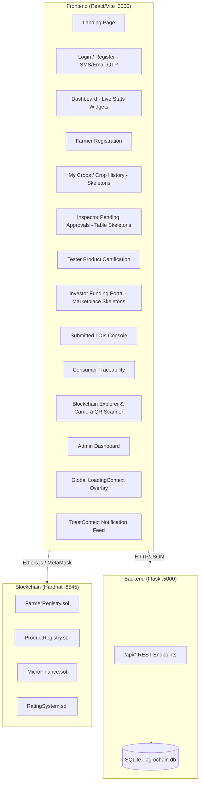

# AgroChain Modernization — Walkthrough

## Overview

The legacy AgroChain project (Truffle + Web3.js + vanilla HTML) has been completely rebuilt as a modern, full-stack decentralized application with three independent layers. It includes advanced stakeholder role separation, geographic inspector/tester routing, walletless consumer ratings, interactive Letters of Intent (LOI) micro-investment portal, downloadable PDF document generation, and role-based real-time notification badges.

| Layer | Technology | Directory |
|-------|-----------|-----------|
| **Blockchain** | Hardhat + Solidity + Ethers.js (v6) | `Blockchain/` |
| **Backend API** | Flask + SQLAlchemy + JWT Auth | `Backend/` |
| **Frontend** | React + Vite + Tailwind CSS + Lucide Icons | `Frontend/` |

---

## Architecture



### Key Architectural Enhancements

1. **Role Separation (Inspector vs. Tester) & Access Control**
   - **Agricultural Inspector (`INSPECTOR`)**: Government officers. Private signup disabled. Created strictly by the Administrator with a generated temporary password. Must change password and link/verify their wallet via cryptographic signature on first login. Performs field checks of cultivations. Holds the **`AGRICULTURE_ROLE`** on-chain for crop approvals.
   - **Quality Lab Tester (`TESTER`)**: Laboratory personnel. Can either self-register (enters `PENDING_APPROVAL` status requiring admin activation) or be directly created by the Administrator (enters `PENDING_SETUP` status requiring password reset + wallet linking on first login). Holds the **`QUALITY_TESTOR_ROLE`** on-chain for certifying product lots. Approved and active testers receive post-harvest crop assignments, conduct quality testing, and certify crop batches.
2. **Forced Onboarding & Combined Setup Modal**
   - Both Inspectors and Testers created by the Admin start in `PENDING_SETUP` status. Upon first login, they are greeted by a mandatory setup wizard requiring them to reset their password and connect/verify their MetaMask wallet via message signature (`personal_sign`). Once verified, their account status transitions to `ACTIVE` and they become eligible for regional crop assignments.
3. **Kerala Priority Location Assignment Hierarchy**
   - Cultivated crops are routed automatically based on a 4-tier location assignment algorithm:
     - **Priority 1**: Verifier (Inspector/Tester) in the same Taluk (Sub-district) & District.
     - **Priority 2**: Verifier in the same District.
     - **Priority 3**: Verifier in a neighboring/adjacent district (using a static Kerala district adjacency map).
     - **Priority 4**: Any active system fallback verifier.
4. **Separate Reject Flows for Stakeholders**
   - **Inspectors**: Can approve or reject crop registration.
   - **Testers**: Can reject a crop lot certificate. Rejecting a lot executes `registerProduct` on the `ProductRegistry` smart contract with status `'REJECTED'` and a price of `0` in Wei, logs the transaction, marks the database cultivation timeline status as `'REJECTED'`, and hides the printable certificate/QR actions.
5. **On-Chain Role Pre-checks & Warning Banners**
   - Both Agricultural Inspectors and Quality Lab Testers have on-chain role checks performed reactive to wallet connections. If their MetaMask wallet address lacks `AGRICULTURE_ROLE` or `QUALITY_TESTOR_ROLE` respectively, a warning banner is shown prompting them to get authorized by the Administrator.
6. **Separate Evidence Storage & Detailed Metadata**
   - Crop evidence is split into `evidence_photos` (visual proofs) and `evidence_documents` (PDF deeds, tax receipts, and soil tests).
   - Stores rich inspection metadata: `inspection_date`, `inspection_notes`, and `inspection_method` (`PHYSICAL_VISIT`, `PHOTO_REVIEW`, or `HYBRID`).
7. **Walletless Web2 Ratings for Consumers**
   - Consumers and farmers remain completely walletless. Consumers can rate farmers via SQLite (`DB_ONLY`) or on-chain using MetaMask if they choose.
8. **Investor Letters of Intent (LOI) Portal & Cancellations**
   - Investors can propose funding and returns share on certified product lots, unlocking contact info upon farmer approval. They can cancel pending proposals via the dashboard, removing the record and logging an audit event.
9. **Printable Document Center**
   - Direct downloads for **Crop Verification Letters** and **Quality Certificates** as PDFs using `html2pdf.js` with forced light-mode formatting.
10. **Integrated Camera QR Scanning**
    - The Blockchain Explorer features an interactive, browser-based QR scanner using `html5-qrcode`. A dynamic socket-based local IP resolver detects the host's LAN IP to build valid QR routing targets.
11. **Visual Loading Skeletons & Global overlays**
    - Premium structural skeletons (`Skeletons.jsx`) prevent layouts from jumping during asynchronous operations. A global loading context blocks user interaction with a frosted overlay during critical actions.
12. **Dual-Factor OTP Validation**
    - Signup accounts require phone verification (SMS gateway client with Indian normalization/spam cooldown) and email verification (async SMTP server).

---

## Smart Contracts

Four modular Solidity contracts using OpenZeppelin `AccessControl`:

| Contract | Purpose | Key Functions |
|----------|---------|---------------|
| [FarmerRegistry.sol](file:///c:/MY%20PROJECTS/AgroChain-Morden/Blockchain/contracts/FarmerRegistry.sol) | Register and approve farmers and crops on-chain | `registerFarmer()`, `approveFarmer()`, `getFarmerDetails()` |
| [ProductRegistry.sol](file:///c:/MY%20PROJECTS/AgroChain-Morden/Blockchain/contracts/ProductRegistry.sol) | Certify product lots with quality grades | `registerProduct()`, `getProductDetails()` |
| [MicroFinance.sol](file:///c:/MY%20PROJECTS/AgroChain-Morden/Blockchain/contracts/MicroFinance.sol) | Investor funding and profit distribution | `invest()`, `distributeProfits()` |
| [RatingSystem.sol](file:///c:/MY%20PROJECTS/AgroChain-Morden/Blockchain/contracts/RatingSystem.sol) | Consumer ratings and trust scores | `rateFarmer()`, `getAverageRating()` |

Deployment script: [deploy.js](file:///c:/MY%20PROJECTS/AgroChain-Morden/Blockchain/scripts/deploy.js)

---

## Backend API

### Core Files

| File | Purpose |
|------|---------|
| [app.py](file:///c:/MY%20PROJECTS/AgroChain-Morden/Backend/app.py) | Flask factory with CORS, blueprints, error handling |
| [config.py](file:///c:/MY%20PROJECTS/AgroChain-Morden/Backend/config.py) | Database URI, JWT secrets |
| [models.py](file:///c:/MY%20PROJECTS/AgroChain-Morden/Backend/models.py) | SQLAlchemy models: User, Farmer, Product, Investment, Rating, Transaction, AuditLog, CropUpdate |
| [seed.py](file:///c:/MY%20PROJECTS/AgroChain-Morden/Backend/seed.py) | Database seeding script containing realistic user roles and location mock data |

### API Routes

| Blueprint | Prefix | File |
|-----------|--------|------|
| Auth | `/api/auth` | [auth.py](file:///c:/MY%20PROJECTS/AgroChain-Morden/Backend/routes/auth.py) |
| Farmer | `/api/farmer` | [farmer.py](file:///c:/MY%20PROJECTS/AgroChain-Morden/Backend/routes/farmer.py) |
| Quality | `/api/quality` | [quality.py](file:///c:/MY%20PROJECTS/AgroChain-Morden/Backend/routes/quality.py) |
| Product | `/api/product` | [product.py](file:///c:/MY%20PROJECTS/AgroChain-Morden/Backend/routes/product.py) |
| Finance | `/api/finance` | [finance.py](file:///c:/MY%20PROJECTS/AgroChain-Morden/Backend/routes/finance.py) |
| Rating | `/api/rating` | [rating.py](file:///c:/MY%20PROJECTS/AgroChain-Morden/Backend/routes/rating.py) |
| Explorer | `/api/explorer` | [explorer.py](file:///c:/MY%20PROJECTS/AgroChain-Morden/Backend/routes/explorer.py) |
| Admin | `/api/admin` | [admin.py](file:///c:/MY%20PROJECTS/AgroChain-Morden/Backend/routes/admin.py) |

### Test Credentials

| Role | Name | Email | Password |
|------|------|-------|----------|
| Admin | System Administrator | `admin@gmail.com` | `test@123` |
| Farmer | Rajesh Patel | `farmer@gmail.com` | `test@123` |
| Inspector | Rajiv Kumar | `inspector@gmail.com` | `test@123` |
| Tester | Dr. Anita Sharma | `tester@gmail.com` | `test@123` |
| Consumer | Amit Kumar | `consumer@gmail.com` | `test@123` |
| Investor | Suresh Mehta | `investor@gmail.com` | `test@123` |

---

## Frontend Pages

| Page | Route | File | Purpose |
|------|-------|------|---------|
| Landing | `/` | [LandingPage.jsx](file:///c:/MY%20PROJECTS/AgroChain-Morden/Frontend/src/pages/LandingPage.jsx) | Entry point with animations & platform overview |
| Login | `/login` | [LoginPage.jsx](file:///c:/MY%20PROJECTS/AgroChain-Morden/Frontend/src/pages/LoginPage.jsx) | JWT authentication & OTP logging |
| Register | `/register` | [RegisterPage.jsx](file:///c:/MY%20PROJECTS/AgroChain-Morden/Frontend/src/pages/RegisterPage.jsx) | Onboarding with district and PIN code parameters |
| Dashboard | `/dashboard` | [Dashboard.jsx](file:///c:/MY%20PROJECTS/AgroChain-Morden/Frontend/src/pages/Dashboard.jsx) | Role-tailored consoles, metrics, notifications, and badges |
| Farmer Registration | `/farmer/register` | [FarmerRegistration.jsx](file:///c:/MY%20PROJECTS/AgroChain-Morden/Frontend/src/pages/FarmerRegistration.jsx) | Register crop location, land survey, GPS and evidence photos |
| Crop History | `/farmer/crops` | [CropHistory.jsx](file:///c:/MY%20PROJECTS/AgroChain-Morden/Frontend/src/pages/CropHistory.jsx) | Farmer document center, timeline advances, printable downloads |
| Quality Testing | `/tester/approve` | [QualityTesting.jsx](file:///c:/MY%20PROJECTS/AgroChain-Morden/Frontend/src/pages/QualityTesting.jsx) | Inspector interface to view and verify region-specific crops |
| Product Certification | `/tester/product` | [ProductRegistration.jsx](file:///c:/MY%20PROJECTS/AgroChain-Morden/Frontend/src/pages/ProductRegistration.jsx) | Tester interface to input laboratory details and certify lots |
| Submitted LOIs | `/investor/lois` | [SubmittedLOIs.jsx](file:///c:/MY%20PROJECTS/AgroChain-Morden/Frontend/src/pages/SubmittedLOIs.jsx) | Investor tracking for submitted Letters of Intent (LOI) |
| Funding Portal | `/finance` | [FundingPage.jsx](file:///c:/MY%20PROJECTS/AgroChain-Morden/Frontend/src/pages/FundingPage.jsx) | Escrow investment dashboard with sticky wizard and auto-scroll |
| Consumer Traceability | `/consumer/track` | [ConsumerTracking.jsx](file:///c:/MY%20PROJECTS/AgroChain-Morden/Frontend/src/pages/ConsumerTracking.jsx) | Public provenance lookup, crop maps, review forms, and restricted LOI warning for non-investor roles |
| Blockchain Explorer | `/explorer` | [BlockchainExplorer.jsx](file:///c:/MY%20PROJECTS/AgroChain-Morden/Frontend/src/pages/BlockchainExplorer.jsx) | On-chain ledger tracker parsing URL query parameters |
| Admin Console | `/admin` | [AdminDashboard.jsx](file:///c:/MY%20PROJECTS/AgroChain-Morden/Frontend/src/pages/AdminDashboard.jsx) | Central system analytics, user approvals, and audit logs |

### Context Providers

| Provider | File | Purpose |
|----------|------|---------|
| AuthContext | [AuthContext.jsx](file:///c:/MY%20PROJECTS/AgroChain-Morden/Frontend/src/context/AuthContext.jsx) | JWT auth state, login/logout, credentials linkage |
| WalletContext | [WalletContext.jsx](file:///c:/MY%20PROJECTS/AgroChain-Morden/Frontend/src/context/WalletContext.jsx) | MetaMask interface, Ethers.js v6 contract bindings |

---

## How to Run

### Prerequisites
- Node.js 18+, Python 3.10+, MetaMask browser extension

### Terminal 1 — Hardhat Local Node
```bash
cd Blockchain
npx hardhat node
```

### Terminal 2 — Deploy Contracts
```bash
cd Blockchain
npx hardhat run scripts/deploy.js --network localhost
```

### Terminal 3 — Flask Backend
```bash
cd Backend
pip install -r requirements.txt
python seed.py --reset  # Clean-rebuild SQLite DB with mock locations and users
python app.py           # Runs Flask on http://127.0.0.1:5000
```

### Terminal 4 — Vite Frontend
```bash
cd Frontend
npm install
npm run dev             # Starts dev server on http://localhost:3000
```

---

## Verified End-to-End Workflow

The complete stakeholder verification workflow functions as follows:

```
[Farmer registers crop] 
       │ (Assigned via Location-based matching algorithm)
       ▼
[Inspector approves land & survey] (Requires MetaMask sign-off)
       │ (Crops move to tester queue)
       ▼
[Tester certifies product lot] (Issues Grade, sets price, locks on-chain)
       │ (Products listed in microfinance portal)
       ▼
[Investor submits Letter of Intent (LOI)] (Bidding terms in Rs.)
       │ (Farmers receive alert badges)
       ▼
[Farmer accepts proposal] (Unlocks contact details)
       │ (Investor funds via Escrow)
       ▼
[Investor transfers ETH on-chain] (Transfers funds via MicroFinance.sol)
       │ (Supply chain public listing)
       ▼
[Consumer tracks provenance] (QR scan redirects to explorer portal)
       │ (Rating submitted)
       ▼
[Consumer rates farmer (Walletless/On-chain)] (Updates trust metrics)
```

---

## Validation Results

| Check | Status |
|-------|--------|
| Smart contracts compile and test successfully | ✅ |
| Contracts deploy to local hardhat network | ✅ |
| Database seeds with users, crop history, and product lots | ✅ |
| Kerala Priority location matching routes inspectors and testers correctly (Taluk -> District -> Neighboring -> Fallback) | ✅ |
| Admin-only verifier creation (Inspector and Tester) with temporary password generation | ✅ |
| Forced password change and wallet connection on first login for PENDING_SETUP inspectors & testers | ✅ |
| MetaMask wallet signature verification for both inspector and tester activation | ✅ |
| Quality Lab self-registration with specific credentials (license, accreditation, certificates) | ✅ |
| Admin credentials review modal and approval flow for self-registered Quality Labs | ✅ |
| Crop assignments routed only to active, active-approved Quality Labs | ✅ |
| Separate Approve / Reject Lot options for Quality Lab Testers | ✅ |
| MetaMask wallet warnings displayed for active Quality Labs lacking linked wallets | ✅ |
| Separate evidence storage for photos (`evidence_photos`) and PDF docs (`evidence_documents`) | ✅ |
| Inspector notes and method saved directly to database without MetaMask | ✅ |
| Walletless Web2 rating submission vs Web3 verified on-chain rating | ✅ |
| Flask API responds to all endpoints (JWT authenticated routes) | ✅ |
| Production build of React frontend builds successfully | ✅ |
| Direct PDF downloads with forced light-mode layouts | ✅ |
| Dark/light mode theme toggle rendering properly | ✅ |
| Role-based protected routes verified in React Router | ✅ |
| Role-based on-chain authorization separated (`AGRICULTURE_ROLE` & `QUALITY_TESTOR_ROLE`) | ✅ |
| Warnings displayed reactively for inspectors and testers lacking on-chain authorization | ✅ |
| SMS Gate Android app receives OTP via correct API payload `{ "message": "...", "phoneNumbers": ["+91..."] }` | ✅ |
| All Indian phone number formats normalised to 10-digit (handles `9895...`, `09895...`, `919895...`, `+919895...`) | ✅ |
| OTP resend blocked within 60 seconds (HTTP 429 rate-limit enforced) | ✅ |
| SMS gateway network errors surface descriptive messages (URLError vs HTTPError vs generic Exception) | ✅ |
| Dual-Factor OTP verification (Phone + Email verification codes required for signup) | ✅ |
| Global LoadingContext Translucent Overlay and Toast Notification Framework | ✅ |
| Interactive browser camera-based QR Code Scanner modal on Blockchain Explorer | ✅ |
| Visual Skeleton screens (Table, Marketplace, Crop history, Dashboard Skeletons) | ✅ |
| Role-specific dashboard stats widgets displaying real committed capital, verified crops, and certs issued counts | ✅ |
| Proposal cancellation endpoint (removes proposal, logs INVESTMENT_CANCELLED event) | ✅ |

