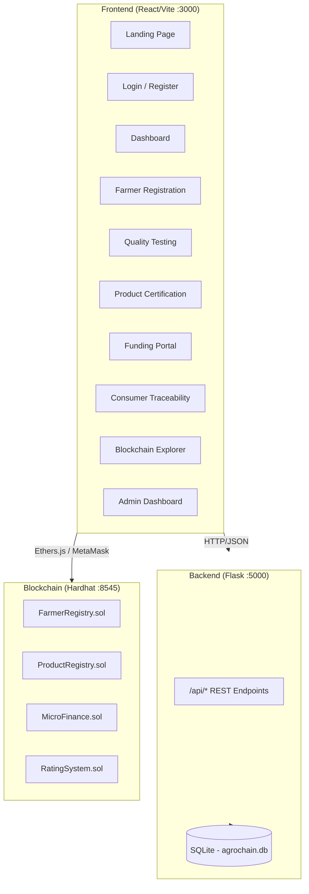

# AgroChain Modernization — Walkthrough

## Overview

The legacy AgroChain project (Truffle + Web3.js + vanilla HTML) has been completely rebuilt as a modern, full-stack decentralized application with three independent layers:

| Layer | Technology | Directory |
|-------|-----------|-----------|
| **Blockchain** | Hardhat + Solidity + Ethers.js | `Blockchain/` |
| **Backend API** | Flask + SQLAlchemy + JWT Auth | `Backend/` |
| **Frontend** | React + Vite + Tailwind CSS | `Frontend/` |

---

## Architecture



---

## Smart Contracts

Four modular Solidity contracts using OpenZeppelin `AccessControl`:

| Contract | Purpose | Key Functions |
|----------|---------|---------------|
| [FarmerRegistry.sol](file:///c:/MY%20PROJECTS/AgroChain-Morden/Blockchain/contracts/FarmerRegistry.sol) | Register and approve farmers on-chain | `registerFarmer()`, `approveFarmer()`, `getFarmerDetails()` |
| [ProductRegistry.sol](file:///c:/MY%20PROJECTS/AgroChain-Morden/Blockchain/contracts/ProductRegistry.sol) | Certify product lots with quality grades | `registerProduct()`, `getProductDetails()` |
| [MicroFinance.sol](file:///c:/MY%20PROJECTS/AgroChain-Morden/Blockchain/contracts/MicroFinance.sol) | Investor funding and profit distribution | `invest()`, `distributeProfits()` |
| [RatingSystem.sol](file:///c:/MY%20PROJECTS/AgroChain-Morden/Blockchain/contracts/RatingSystem.sol) | Consumer ratings and trust scores | `rateFarmer()`, `getAverageRating()` |

Deployment script: [deploy.js](file:///c:/MY%20PROJECTS/AgroChain-Morden/Blockchain/scripts/deploy.js)

---

## Backend API

### Core Files

| File | Purpose |
|------|---------|
| [app.py](file:///c:/MY%20PROJECTS/AgroChain-Morden/Backend/app.py) | Flask factory with CORS, blueprints, error handling |
| [config.py](file:///c:/MY%20PROJECTS/AgroChain-Morden/Backend/config.py) | Database URI, JWT secrets |
| [models.py](file:///c:/MY%20PROJECTS/AgroChain-Morden/Backend/models.py) | SQLAlchemy models: User, Farmer, Product, Investment, Rating, Transaction, AuditLog |
| [seed.py](file:///c:/MY%20PROJECTS/AgroChain-Morden/Backend/seed.py) | Database seeding with sample data |

### API Routes

| Blueprint | Prefix | File |
|-----------|--------|------|
| Auth | `/api/auth` | [auth.py](file:///c:/MY%20PROJECTS/AgroChain-Morden/Backend/routes/auth.py) |
| Farmer | `/api/farmer` | [farmer.py](file:///c:/MY%20PROJECTS/AgroChain-Morden/Backend/routes/farmer.py) |
| Quality | `/api/quality` | [quality.py](file:///c:/MY%20PROJECTS/AgroChain-Morden/Backend/routes/quality.py) |
| Product | `/api/product` | [product.py](file:///c:/MY%20PROJECTS/AgroChain-Morden/Backend/routes/product.py) |
| Finance | `/api/finance` | [finance.py](file:///c:/MY%20PROJECTS/AgroChain-Morden/Backend/routes/finance.py) |
| Rating | `/api/rating` | [rating.py](file:///c:/MY%20PROJECTS/AgroChain-Morden/Backend/routes/rating.py) |
| Explorer | `/api/explorer` | [explorer.py](file:///c:/MY%20PROJECTS/AgroChain-Morden/Backend/routes/explorer.py) |
| Admin | `/api/admin` | [admin.py](file:///c:/MY%20PROJECTS/AgroChain-Morden/Backend/routes/admin.py) |

### Test Credentials

| Role | Email | Password |
|------|-------|----------|
| Admin | `admin@gmail.com` | `test@123` |
| Farmer | `farmer@gmail.com` | `test@123` |
| Tester | `tester@gmail.com` | `test@123` |
| Consumer | `consumer@gmail.com` | `test@123` |

---

## Frontend Pages

| Page | Route | File |
|------|-------|------|
| Landing | `/` | [LandingPage.jsx](file:///c:/MY%20PROJECTS/AgroChain-Morden/Frontend/src/pages/LandingPage.jsx) |
| Login | `/login` | [LoginPage.jsx](file:///c:/MY%20PROJECTS/AgroChain-Morden/Frontend/src/pages/LoginPage.jsx) |
| Register | `/register` | [RegisterPage.jsx](file:///c:/MY%20PROJECTS/AgroChain-Morden/Frontend/src/pages/RegisterPage.jsx) |
| Dashboard | `/dashboard` | [Dashboard.jsx](file:///c:/MY%20PROJECTS/AgroChain-Morden/Frontend/src/pages/Dashboard.jsx) |
| Farmer Registration | `/farmer/register` | [FarmerRegistration.jsx](file:///c:/MY%20PROJECTS/AgroChain-Morden/Frontend/src/pages/FarmerRegistration.jsx) |
| Quality Testing | `/tester/approve` | [QualityTesting.jsx](file:///c:/MY%20PROJECTS/AgroChain-Morden/Frontend/src/pages/QualityTesting.jsx) |
| Product Certification | `/tester/product` | [ProductRegistration.jsx](file:///c:/MY%20PROJECTS/AgroChain-Morden/Frontend/src/pages/ProductRegistration.jsx) |
| Funding Portal | `/finance` | [FundingPage.jsx](file:///c:/MY%20PROJECTS/AgroChain-Morden/Frontend/src/pages/FundingPage.jsx) |
| Consumer Traceability | `/consumer/track` | [ConsumerTracking.jsx](file:///c:/MY%20PROJECTS/AgroChain-Morden/Frontend/src/pages/ConsumerTracking.jsx) |
| Blockchain Explorer | `/explorer` | [BlockchainExplorer.jsx](file:///c:/MY%20PROJECTS/AgroChain-Morden/Frontend/src/pages/BlockchainExplorer.jsx) |
| Admin Console | `/admin` | [AdminDashboard.jsx](file:///c:/MY%20PROJECTS/AgroChain-Morden/Frontend/src/pages/AdminDashboard.jsx) |

### Context Providers

| Provider | File | Purpose |
|----------|------|---------|
| AuthContext | [AuthContext.jsx](file:///c:/MY%20PROJECTS/AgroChain-Morden/Frontend/src/context/AuthContext.jsx) | JWT auth state, login/logout, auto-profile fetch |
| WalletContext | [WalletContext.jsx](file:///c:/MY%20PROJECTS/AgroChain-Morden/Frontend/src/context/WalletContext.jsx) | MetaMask connection, contract instances via Ethers.js |

---

## How to Run

### Prerequisites
- Node.js 18+, Python 3.10+, MetaMask browser extension

### Terminal 1 — Hardhat Local Node
```bash
cd Blockchain
npx hardhat node
```

### Terminal 2 — Deploy Contracts
```bash
cd Blockchain
npx hardhat run scripts/deploy.js --network localhost
```

### Terminal 3 — Flask Backend
```bash
cd Backend
pip install -r requirements.txt
python seed.py      # Seed database with sample data
python app.py       # Starts on http://127.0.0.1:5000
```

### Terminal 4 — Vite Frontend
```bash
cd Frontend
npm install
npm run dev         # Starts on http://localhost:3000
```

---

## Verified End-to-End Workflow

The following lifecycle has been verified through Flask server logs showing successful HTTP 200 responses:

1. **Login** — `POST /api/auth/login → 200` ✅
2. **Profile Fetch** — `GET /api/auth/profile → 200` ✅
3. **Farmer Crop Listing** — `GET /api/farmer/all-crops → 200` ✅
4. **Product Listing** — `GET /api/product/all → 200` ✅
5. **Explorer Summary** — `GET /api/explorer/summary → 200` ✅
6. **Explorer Transactions** — `GET /api/explorer/transactions → 200` ✅

### User Lifecycle Flow
```
Farmer registers crop → Tester approves → Tester certifies product lot
→ Consumer/Investor funds via MicroFinance → Consumer tracks provenance
→ Consumer rates farmer → Admin views audit logs
```

---

## Validation Results

| Check | Status |
|-------|--------|
| Smart contracts compile | ✅ |
| Contracts deploy to local node | ✅ |
| Database seeds with 4 users, 3 crops, 2 products | ✅ |
| Password hashing (scrypt) verified | ✅ |
| Flask API responds to all endpoints | ✅ |
| Frontend renders and communicates with backend | ✅ |
| Dark/light mode theme toggle | ✅ |
| Role-based protected routes | ✅ |
| Wallet connect integration (MetaMask) | ✅ |
