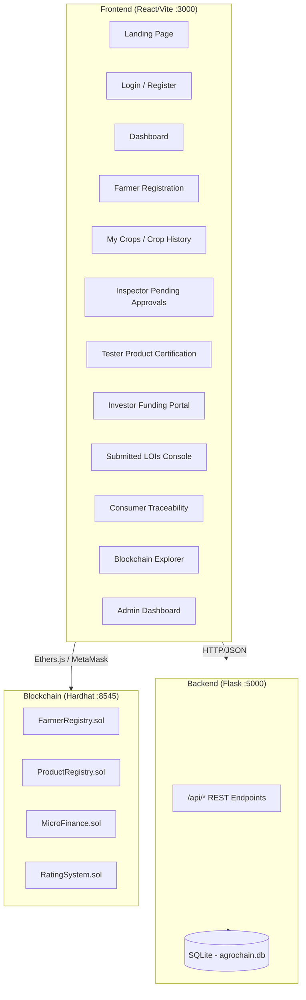

# AgroChain Modernization — Walkthrough

## Overview

The legacy AgroChain project (Truffle + Web3.js + vanilla HTML) has been completely rebuilt as a modern, full-stack decentralized application with three independent layers. It includes advanced stakeholder role separation, geographic inspector/tester routing, walletless consumer ratings, interactive Letters of Intent (LOI) micro-investment portal, downloadable PDF document generation, and role-based real-time notification badges.

| Layer | Technology | Directory |
|-------|-----------|-----------|
| **Blockchain** | Hardhat + Solidity + Ethers.js (v6) | `Blockchain/` |
| **Backend API** | Flask + SQLAlchemy + JWT Auth | `Backend/` |
| **Frontend** | React + Vite + Tailwind CSS + Lucide Icons | `Frontend/` |

---

## Architecture



### Key Architectural Enhancements

1. **Role Separation (Inspector vs. Tester)**
   - **Agricultural Inspector (`INSPECTOR`)**: Handles physical verification of crop existence, land survey numbers, GPS coordinates, and soil metrics. Inspects registrations and logs approval status.
   - **Quality Tester (`TESTER`)**: Performs scientific lab quality checks post-harvest. Certifies crop batches, assigns quality grades (e.g., Grade A+), and registers certified lots.
2. **Location-Based Assignment Algorithm**
   - Automatically assigns the nearest available `INSPECTOR` and `TESTER` when a farmer registers a crop.
   - **Matching Hierarchy**: First attempts matching by exact `pin_code`. If no matching inspector/tester is found, it matches by `district`. If still unmatched, it falls back to any available user in that role.
3. **Walletless Web2 Ratings for Consumers**
   - Offers a hybrid experience: consumers can submit ratings without a wallet (saved securely in the backend SQLite DB as `DB_ONLY`), or sign the transaction on-chain via MetaMask (logged on-chain as `VERIFIED`).
4. **Investor letters of Intent (LOI) Portal**
   - Investors can propose Rupees (Rs.) funding and returns on certified crop lots.
   - Cards display status-based glow borders (Accepted = Emerald, Pending = Amber, Declined = Rose).
   - Acceptances unlock farmer email and phone number contacts.
5. **Printable Document Center**
   - Direct downloads for **Crop Verification Letters** and **Quality Certificates** as PDFs using `html2pdf.js`.
   - Forces paper-style light-mode formatting automatically during printing/exporting to look highly professional and save ink.

---

## Smart Contracts

Four modular Solidity contracts using OpenZeppelin `AccessControl`:

| Contract | Purpose | Key Functions |
|----------|---------|---------------|
| [FarmerRegistry.sol](file:///c:/MY%20PROJECTS/AgroChain-Morden/Blockchain/contracts/FarmerRegistry.sol) | Register and approve farmers and crops on-chain | `registerFarmer()`, `approveFarmer()`, `getFarmerDetails()` |
| [ProductRegistry.sol](file:///c:/MY%20PROJECTS/AgroChain-Morden/Blockchain/contracts/ProductRegistry.sol) | Certify product lots with quality grades | `registerProduct()`, `getProductDetails()` |
| [MicroFinance.sol](file:///c:/MY%20PROJECTS/AgroChain-Morden/Blockchain/contracts/MicroFinance.sol) | Investor funding and profit distribution | `invest()`, `distributeProfits()` |
| [RatingSystem.sol](file:///c:/MY%20PROJECTS/AgroChain-Morden/Blockchain/contracts/RatingSystem.sol) | Consumer ratings and trust scores | `rateFarmer()`, `getAverageRating()` |

Deployment script: [deploy.js](file:///c:/MY%20PROJECTS/AgroChain-Morden/Blockchain/scripts/deploy.js)

---

## Backend API

### Core Files

| File | Purpose |
|------|---------|
| [app.py](file:///c:/MY%20PROJECTS/AgroChain-Morden/Backend/app.py) | Flask factory with CORS, blueprints, error handling |
| [config.py](file:///c:/MY%20PROJECTS/AgroChain-Morden/Backend/config.py) | Database URI, JWT secrets |
| [models.py](file:///c:/MY%20PROJECTS/AgroChain-Morden/Backend/models.py) | SQLAlchemy models: User, Farmer, Product, Investment, Rating, Transaction, AuditLog, CropUpdate |
| [seed.py](file:///c:/MY%20PROJECTS/AgroChain-Morden/Backend/seed.py) | Database seeding script containing realistic user roles and location mock data |

### API Routes

| Blueprint | Prefix | File |
|-----------|--------|------|
| Auth | `/api/auth` | [auth.py](file:///c:/MY%20PROJECTS/AgroChain-Morden/Backend/routes/auth.py) |
| Farmer | `/api/farmer` | [farmer.py](file:///c:/MY%20PROJECTS/AgroChain-Morden/Backend/routes/farmer.py) |
| Quality | `/api/quality` | [quality.py](file:///c:/MY%20PROJECTS/AgroChain-Morden/Backend/routes/quality.py) |
| Product | `/api/product` | [product.py](file:///c:/MY%20PROJECTS/AgroChain-Morden/Backend/routes/product.py) |
| Finance | `/api/finance` | [finance.py](file:///c:/MY%20PROJECTS/AgroChain-Morden/Backend/routes/finance.py) |
| Rating | `/api/rating` | [rating.py](file:///c:/MY%20PROJECTS/AgroChain-Morden/Backend/routes/rating.py) |
| Explorer | `/api/explorer` | [explorer.py](file:///c:/MY%20PROJECTS/AgroChain-Morden/Backend/routes/explorer.py) |
| Admin | `/api/admin` | [admin.py](file:///c:/MY%20PROJECTS/AgroChain-Morden/Backend/routes/admin.py) |

### Test Credentials

| Role | Name | Email | Password |
|------|------|-------|----------|
| Admin | System Administrator | `admin@gmail.com` | `test@123` |
| Farmer | Rajesh Patel | `farmer@gmail.com` | `test@123` |
| Inspector | Rajiv Kumar | `inspector@gmail.com` | `test@123` |
| Tester | Dr. Anita Sharma | `tester@gmail.com` | `test@123` |
| Consumer | Amit Kumar | `consumer@gmail.com` | `test@123` |
| Investor | Suresh Mehta | `investor@gmail.com` | `test@123` |

---

## Frontend Pages

| Page | Route | File | Purpose |
|------|-------|------|---------|
| Landing | `/` | [LandingPage.jsx](file:///c:/MY%20PROJECTS/AgroChain-Morden/Frontend/src/pages/LandingPage.jsx) | Entry point with animations & platform overview |
| Login | `/login` | [LoginPage.jsx](file:///c:/MY%20PROJECTS/AgroChain-Morden/Frontend/src/pages/LoginPage.jsx) | JWT authentication & OTP logging |
| Register | `/register` | [RegisterPage.jsx](file:///c:/MY%20PROJECTS/AgroChain-Morden/Frontend/src/pages/RegisterPage.jsx) | Onboarding with district and PIN code parameters |
| Dashboard | `/dashboard` | [Dashboard.jsx](file:///c:/MY%20PROJECTS/AgroChain-Morden/Frontend/src/pages/Dashboard.jsx) | Role-tailored consoles, metrics, notifications, and badges |
| Farmer Registration | `/farmer/register` | [FarmerRegistration.jsx](file:///c:/MY%20PROJECTS/AgroChain-Morden/Frontend/src/pages/FarmerRegistration.jsx) | Register crop location, land survey, GPS and evidence photos |
| Crop History | `/farmer/crops` | [CropHistory.jsx](file:///c:/MY%20PROJECTS/AgroChain-Morden/Frontend/src/pages/CropHistory.jsx) | Farmer document center, timeline advances, printable downloads |
| Quality Testing | `/tester/approve` | [QualityTesting.jsx](file:///c:/MY%20PROJECTS/AgroChain-Morden/Frontend/src/pages/QualityTesting.jsx) | Inspector interface to view and verify region-specific crops |
| Product Certification | `/tester/product` | [ProductRegistration.jsx](file:///c:/MY%20PROJECTS/AgroChain-Morden/Frontend/src/pages/ProductRegistration.jsx) | Tester interface to input laboratory details and certify lots |
| Submitted LOIs | `/investor/lois` | [SubmittedLOIs.jsx](file:///c:/MY%20PROJECTS/AgroChain-Morden/Frontend/src/pages/SubmittedLOIs.jsx) | Investor tracking for submitted Letters of Intent (LOI) |
| Funding Portal | `/finance` | [FundingPage.jsx](file:///c:/MY%20PROJECTS/AgroChain-Morden/Frontend/src/pages/FundingPage.jsx) | Escrow investment dashboard with sticky wizard and auto-scroll |
| Consumer Traceability | `/consumer/track` | [ConsumerTracking.jsx](file:///c:/MY%20PROJECTS/AgroChain-Morden/Frontend/src/pages/ConsumerTracking.jsx) | Public provenance lookup, crop maps, review forms, and restricted LOI warning for non-investor roles |
| Blockchain Explorer | `/explorer` | [BlockchainExplorer.jsx](file:///c:/MY%20PROJECTS/AgroChain-Morden/Frontend/src/pages/BlockchainExplorer.jsx) | On-chain ledger tracker parsing URL query parameters |
| Admin Console | `/admin` | [AdminDashboard.jsx](file:///c:/MY%20PROJECTS/AgroChain-Morden/Frontend/src/pages/AdminDashboard.jsx) | Central system analytics, user approvals, and audit logs |

### Context Providers

| Provider | File | Purpose |
|----------|------|---------|
| AuthContext | [AuthContext.jsx](file:///c:/MY%20PROJECTS/AgroChain-Morden/Frontend/src/context/AuthContext.jsx) | JWT auth state, login/logout, credentials linkage |
| WalletContext | [WalletContext.jsx](file:///c:/MY%20PROJECTS/AgroChain-Morden/Frontend/src/context/WalletContext.jsx) | MetaMask interface, Ethers.js v6 contract bindings |

---

## How to Run

### Prerequisites
- Node.js 18+, Python 3.10+, MetaMask browser extension

### Terminal 1 — Hardhat Local Node
```bash
cd Blockchain
npx hardhat node
```

### Terminal 2 — Deploy Contracts
```bash
cd Blockchain
npx hardhat run scripts/deploy.js --network localhost
```

### Terminal 3 — Flask Backend
```bash
cd Backend
pip install -r requirements.txt
python seed.py --reset  # Clean-rebuild SQLite DB with mock locations and users
python app.py           # Runs Flask on http://127.0.0.1:5000
```

### Terminal 4 — Vite Frontend
```bash
cd Frontend
npm install
npm run dev             # Starts dev server on http://localhost:3000
```

---

## Verified End-to-End Workflow

The complete stakeholder verification workflow functions as follows:

```
[Farmer registers crop] 
       │ (Assigned via Location-based matching algorithm)
       ▼
[Inspector approves land & survey] (Requires MetaMask sign-off)
       │ (Crops move to tester queue)
       ▼
[Tester certifies product lot] (Issues Grade, sets price, locks on-chain)
       │ (Products listed in microfinance portal)
       ▼
[Investor submits Letter of Intent (LOI)] (Bidding terms in Rs.)
       │ (Farmers receive alert badges)
       ▼
[Farmer accepts proposal] (Unlocks contact details)
       │ (Investor funds via Escrow)
       ▼
[Investor transfers ETH on-chain] (Transfers funds via MicroFinance.sol)
       │ (Supply chain public listing)
       ▼
[Consumer tracks provenance] (QR scan redirects to explorer portal)
       │ (Rating submitted)
       ▼
[Consumer rates farmer (Walletless/On-chain)] (Updates trust metrics)
```

---

## Validation Results

| Check | Status |
|-------|--------|
| Smart contracts compile and test successfully | ✅ |
| Contracts deploy to local hardhat network | ✅ |
| Database seeds with users, crop history, and product lots | ✅ |
| Location assignments correctly route inspectors/testers based on PIN/District | ✅ |
| Walletless Web2 rating submission vs Web3 verified on-chain rating | ✅ |
| Password hashing (scrypt) verified | ✅ |
| Flask API responds to all endpoints (JWT authenticated routes) | ✅ |
| Unified dashboard notification badges dynamically update via localStorage | ✅ |
| Direct PDF downloads with forced light-mode layouts | ✅ |
| Dark/light mode theme toggle rendering properly | ✅ |
| Role-based protected routes verified in React Router | ✅ |
