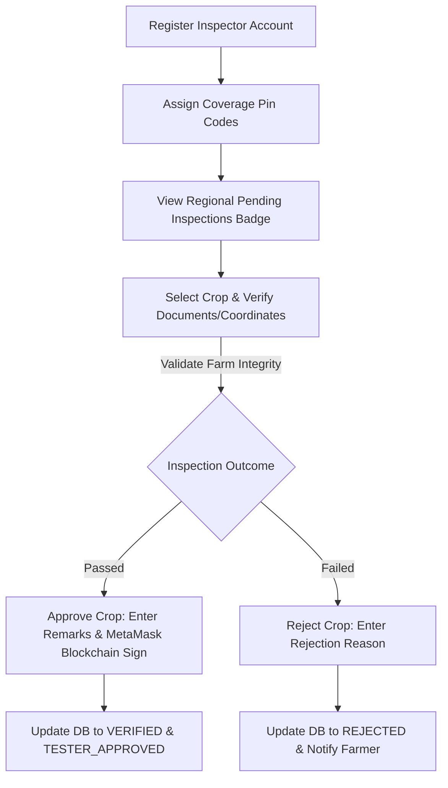
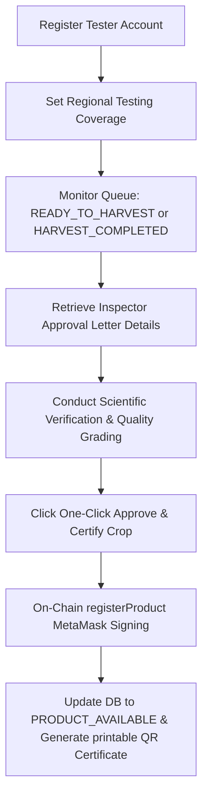
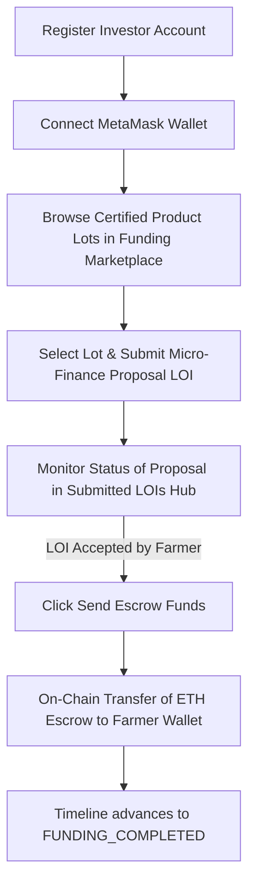
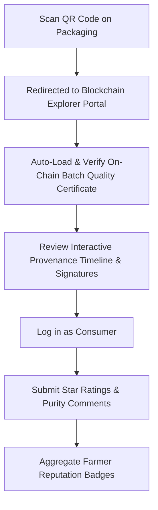
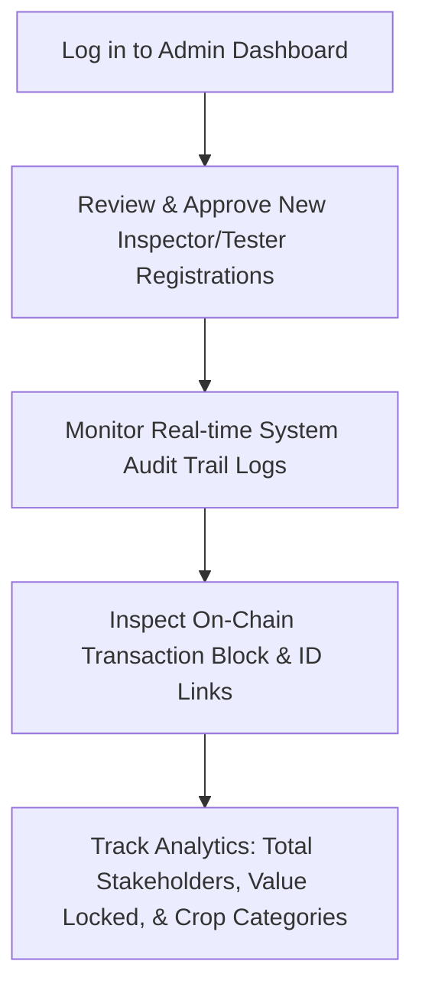

# AgroChain Platform Workflow Reference Guide

This document provides a comprehensive, end-to-end breakdown of the user workflows on the **AgroChain** platform. It outlines the platform operations, database state changes, and blockchain transactions from the perspective of each of the six user roles: **Farmer**, **Agricultural Inspector**, **Quality Lab Tester**, **Dedicated Investor**, **System Administrator**, and **Consumer**.

## Master System Workflow

Here is the high-level layout of the complete AgroChain verification, certification, and funding ecosystem:

```mermaid
flowchart LR
    User([User]) --> Register[Register Crop]
    Register --> InspectorAudit[Inspector Audit]
    InspectorAudit --> Harvest[Harvest Completed]
    Harvest --> LabCert[Lab Testing & Certification]
    LabCert --> FundingMarket[Funding Marketplace]
    FundingMarket --> InvestorProposal[Investor Proposal LOI]
    InvestorProposal --> AcceptProposal[Farmer Accepts LOI]
    AcceptProposal --> EscrowFund[Lock & Send Escrow ETH]
```



---

## 1. FARMER WORKFLOW (Master Lifecycle)

The Farmer is the initiator of the agricultural supply chain. Their workflow spans from registering their account to listing crops, updating harvest timelines, printing certificates, and securing micro-finance.

```mermaid
graph TD
    A[Register Account & Verify OTP] --> B[Link Wallet Address (No Gas/MetaMask Required)]
    B --> C[Register Cultivation Crop Details]
    C -->|verification_status: PENDING| D[Inspector Audits & Approves]
    D -->|verification_status: VERIFIED| E[Farmer Downloads Approval Letter]
    E --> H[Update Timeline: READY_TO_HARVEST]
    H --> I[Update Timeline: HARVEST_COMPLETED]
    I --> J[Quality Lab Tester Scientific Certification]
    J -->|timeline_status: PRODUCT_AVAILABLE| K[Farmer Prints Batch Certificate & QR Code]
    K --> F[Receive & Review Investor Proposals / LOIs]
    F -->|Accept Proposal| G[Funding Completed & ETH Escrow Received]
```

### Phase 1: Onboarding & Account setup
1. **Registration & Web2 Security**:
   * Navigate to `/register` and fill in the profile form: Name, Email, Phone Number, Government ID (Aadhaar/PAN), Farm Land Title Ownership Proof URL, District, Pin Code, and Password.
   * Click **"Send OTP"** to trigger a mock/real SMS code.
   * Enter the 6-digit code to verify the phone number. Click **"Sign Up"** to create the user database entry with the role `FARMER`.
2. **Wallet Address Association (No MetaMask/Gas required)**:
   * Log into the Dashboard (`/dashboard`).
   * Click the **"Link Wallet"** button to associate the Farmer's active Ethereum wallet address (`wallet_address` in the database) to their profile.
   * *Note: This is a standard Web2 database association so that investors know where to transfer funding escrow. The Farmer does not need MetaMask, transactions, or gas fees to perform any tasks on the portal.*

### Phase 2: Cultivation Registration
1. **Crop Listing Entry**:
   * Navigate to the **"Register Crop"** portal.
   * Input the cultivation specs: Crop Type (e.g. Organic Wheat), Expected Yield (kg), Land Survey Deed Number, GPS Coordinates (Latitude & Longitude), Farm Location Address, and upload evidence images.
   * Submit the form. This creates a record in the `farmers` database table:
     * `verification_status` is set to `'PENDING'`
     * `timeline_status` is set to `'PENDING'`
     * `blockchain_status` is set to `'DB_ONLY'`
     * `assigned_inspector_id` and `assigned_tester_id` are auto-allocated based on matching District and Pin Code coverage.

### Phase 3: Land & Audit Verification (Inspector Audit)
1. **Awaiting Audit**:
   * The registered crop appears in the designated local Inspector's queue.
   * The Farmer's Dashboard display indicates a **"Pending Tester Audit"** status.
2. **Audit Passed**:
   * Once the Inspector completes the verification and signs the contract on-chain, the crop's `verification_status` becomes `'VERIFIED'` and the timeline status advances to `TESTER_APPROVED`.
   * **Document Unlocked**: The Farmer's **Crop History** portal (`/farmer/crops`) displays the **"View Approval Letter"** button. The Farmer can click it to open and download/print a compliance certificate detailing the land deeds, GPS coordinates, and inspector details.

### Phase 4: Harvesting & Timeline Milestones
As the cultivation cycle progresses, the Farmer manually updates crop progress in **Crop History** to coordinate with the Quality Lab:
1. **Ready to Harvest**:
   * The Farmer moves the crop timeline to `READY_TO_HARVEST`.
2. **Harvest Completed**:
   * Once the yield is harvested, the Farmer updates the timeline to `HARVEST_COMPLETED`.
   * This status change pushes the crop into the regional Quality Lab Tester’s pending queue for lab audits.

### Phase 5: Batch Certification & Sale
1. **Scientific Validation**:
   * The Quality Lab Tester verifies the harvested crop, assigns a quality grade (e.g., `Grade A+`), sets listing prices in Wei, and signs the certificate on-chain.
   * The crop timeline updates to `PRODUCT_AVAILABLE`.
2. **Certificate Printing**:
   * The Farmer's **Crop History** portal unlocks the **"Print Certificate & QR"** button.
   * The Farmer clicks it to view and print the gold-bordered **Batch Quality Certificate** featuring a dynamic QR code.
   * The Farmer attaches the printed QR codes to physical packaging bags.
3. **Public Explorer Listing**:
   * The crop lot is listed publicly in the consumer marketplace directory.

### Phase 6: Funding & Investor Relations
1. **Browsing Proposals**:
   * Once the crop batch is certified, micro-finance investors view the active lot listing in the marketplace and send proposals (Letters of Intent - LOIs) proposing funding amounts (INR), yield profit return margins, and conditions.
   * The Farmer receives a real-time notification badge on their Dashboard indicating new incoming proposals.
2. **Accepting Escrow**:
   * The Farmer clicks **"Accept"** on a chosen investor proposal.
   * The proposal status changes to `ACCEPTED`.
   * The crop timeline status automatically transitions to `FUNDING_COMPLETED`.
   * The Investor initiates the smart contract transaction on `MicroFinance.sol`, transferring the corresponding test ETH directly to the Farmer's linked MetaMask wallet.

---

## 2. AGRICULTURAL INSPECTOR WORKFLOW (Audit & On-Chain Proof)

The Inspector verifies land registry legitimacy, geo-locations, and organic parameters before a crop is approved for on-chain listing.



1. **Inspector Registration & Zone Allocation**:
   * Register an account with the `INSPECTOR` role and specify postal Pin Codes and Districts under their coverage (`coverage_pins`).
2. **Accessing the Pending Queue**:
   * Log into the Dashboard (`/dashboard`).
   * The Inspector sees a notification badge on the **"Pending Inspections"** card indicating crops awaiting verification in their designated pins.
3. **Inspection Audit**:
   * Click on a crop from the queue to view registration files, upload proofs, GPS locations, and survey numbers.
   * Perform physical/soil checks on the farm.
4. **On-Chain Certification**:
   * Input verification remarks (e.g., soil health, land registry matches).
   * Click **"Approve & Register Cultivation"**.
   * MetaMask prompts the Inspector to sign the transaction `farmerRegistry.approveFarmer(cropId, ...)`, locking the cultivation details on the blockchain.
   * The database records the transaction hash and block number, updating status to `VERIFIED` and `TESTER_APPROVED`.
   * *(Alternatively, if the land deeds are forged or parameters fail, the Inspector enters audit failure notes and clicks **"Reject Crop"**, marking `verification_status = 'REJECTED'` and disabling the listing).*

---

## 3. QUALITY LAB TESTER WORKFLOW (Scientific Analysis)

The Quality Lab Tester validates harvested crop yields, certifies food quality parameters, and publishes the certified product batch onto the ledger.



1. **Tester Registration & Verification**:
   * Register with the `TESTER` role, indicating geographical test center codes and postal code coverage.
2. **Harvest Tracking Queue**:
   * Watch the tester dashboard queue for crops marked as `READY_TO_HARVEST` or `HARVEST_COMPLETED` within their region.
   * Check the Inspector's initial **Approval Letter** and notes linked directly on the page.
3. **Batch Quality Testing**:
   * Conduct scientific lab assessments (moisture levels, heavy metal presence, organic purity, pesticide screening).
4. **One-Click Automated Certification**:
   * Select a crop from the list.
   * Click **"Approve & Certify Crop"** on the Quality Testing Portal (`/quality-testing`).
   * This executes the `productRegistry.registerProduct` smart contract.
   * It registers the product lot number, crop name, certified grade (`Grade A+`), pricing details in Wei, test timestamps, and expiry date.
   * The backend database matches the crop ID to the newly certified lot number, moving the status to `PRODUCT_AVAILABLE` (Certified).

---

## 4. DEDICATED INVESTOR WORKFLOW (Micro-Finance Escrow)

The Investor backs trusted farmers, providing low-interest micro-loans in exchange for yield returns.



1. **Investor Registration & Wallet Setup**:
   * Register with the `INVESTOR` role.
   * Connect MetaMask wallet. Ensure test ETH is available.
2. **Browsing Verified Crops**:
   * Navigate to the **"Funding Marketplace"** (`/finance`).
   * Filter crops that are verified by inspectors (`verification_status == 'VERIFIED'`).
3. **Submitting a Proposal (LOI)**:
   * Click **"Fund Crop"** on a chosen cultivation project.
   * Enter the proposal details: Funding Amount (INR), return yield shares, and custom terms.
   * Click **"Send Proposal"** (this logs a pending Letter of Intent in the database).
   * Track status updates on `/investor/lois`.
4. **Funding Escrow Execution**:
   * Once the Farmer clicks "Accept" on the proposal, the status updates to `ACCEPTED`.
   * The Investor clicks **"Send Escrow Funds"** on the LOI card.
   * MetaMask prompts the Investor to confirm the smart contract transaction on `MicroFinance.sol`.
   * The funds are locked and routed securely to the Farmer’s wallet address.

---

## 5. CONSUMER / PUBLIC BUYER WORKFLOW (Transparency & Traceability)

The Consumer traces crop provenance and leaves trust scores.



1. **Provenance Verification (Public Portal)**:
   * Access the public directory (`/consumer/track`) without logging in.
   * Browse available certified crops.
2. **Physical Packing QR Scan**:
   * Scan the QR code printed on the physical crop packaging with a smartphone.
   * The QR code directs the browser to the AgroChain Registry Explorer (e.g. `/explorer?lot=1001`).
   * The page automatically loads and displays the **Batch Quality Certificate** on-chain parameters.
3. **Tracing Chain of Custody**:
   * Review the interactive timeline milestones:
     1. **Cultivation Registered**: Date, Farmer details, and GPS coordinate links.
     2. **Deed Audited**: Inspector details, remarks, and blockchain block number.
     3. **Escrow Funded**: Investor backing proof.
     4. **Lab Certified**: Grade certification (`Grade A+`), test parameters, and expiry.
4. **Submitting Reputation Reviews**:
   * Log in with a `CONSUMER` account.
   * Submit feedback ratings (1-5 stars) assessing: Reliability, Product Quality, and Delivery Satisfaction.
   * The scores are aggregated to compute the farmer's credibility badge.

---

## 6. SYSTEM ADMINISTRATOR WORKFLOW (Governance & Audits)

The Admin monitors the health and compliance of the entire system.



1. **Role Approvals & Registrations**:
   * Log in to the Admin Dashboard.
   * Review registrations of new verifiers (Inspectors and Testers) to verify their credentials.
2. **Audit Trails & Security Monitoring**:
   * Monitor the **System Audit Trail** console (`/dashboard`).
   * View live logs of actions (e.g., `FARMER_CROP_APPROVED`, `PRODUCT_CERTIFIED`, `INVESTMENT_ACCEPTED`).
   * Each log card displays the database ID, operator username, transaction timestamps, and clickable block links.
3. **Ecosystem Analytics**:
   * Analyze crop category distributions, total active stakeholders, value locked, and system flags.
